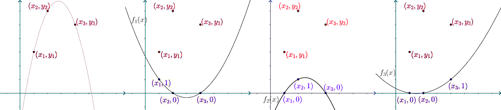
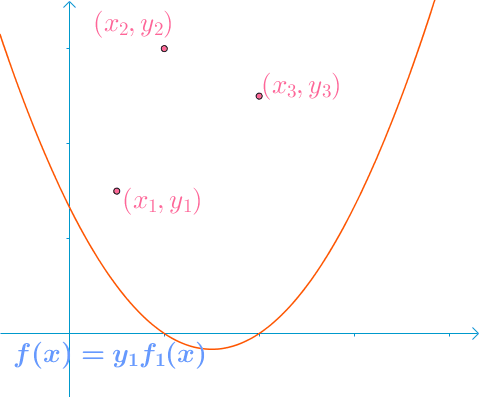
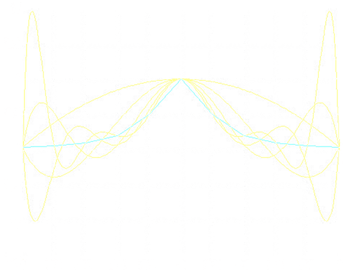

<link rel='stylesheet' href='../../style/index.css'>

# [数值分析：插值逼近](./index.html)

[TOC]

## 插值的定义

设函数$y=f(x)$在区间$[a, b]$上连续，给定$n+1$个节点（$a < x_0 < x_1 < \cdots < x_n < b$，不一定均分），在函数类$P$中寻找$φ(x)$作为$f(x)$的近似表达，使其满足

$$φ(x_k)=f(x_k)=y_k, \,\,\, k=0,1,2,\cdots,n$$

| **被插值函数** | **插值函数** | **插值节点** |  **插值区间** | **插值方法**
| - | - | - | - | -
| $y=f(x)$ | $φ(x)$ | $x_0 < x_1 < \cdots < x_n$ | $[a,b]$ | $φ(x_k)=f(x_k)=y_k$

函数类$P$的不同选取对应不同的插值方法。
满足插值条件的多项式$P_n(x)$存在且唯一。

## 拉格朗日（Lagrange）插值

### 线性插值

邻近的两点连成一条直线，即两点式$\dfrac{L-f(x_1)}{x-x_1} = \dfrac{f(x_2)-f(x_1)}{x_2-x_1}$

$$\begin{array}{l}
    L_2(x) \\ \\\\ \\\\ \\\\
\end{array}
\begin{array}{l}
        = \dfrac{x-x_1}{x_2-x_1}\Big[f(x_2) - f(x_1)\Big] + f(x_1)
\\\\    = \dfrac{x-x_1}{x_2-x_1}f(x_2) + (1-\dfrac{x-x_1}{x_2-x_1})f(x_1)
\\\\    = \dfrac{x-x_2}{x_1-x_2}f(x_1) + \dfrac{x-x_1}{x_2-x_1}f(x_2)
\end{array}$$

### 构造思路

假设已知$(x_1,y_1)$、$(x_2,y_2)$、$(x_3,y_3)$，构造插值函数

$$\begin{matrix}
    L_3(x) = y_1f_1(x) + y_2f_2(x) + y_3f_3(x)
\end{matrix}$$

其中，$f_i(x_j) = \begin{cases}
    1 & i=j
\\  0 & i≠j
\end{cases}$，即选取一组线性无关的基然后确定坐标。

上面讨论中的$f_i(x)$、$y_i$也就是接下来公式中的$l_i(x)$、$f(x_i)$。该方法的缺陷是，当精度不够需要增加节点时，要重新确定基，即重新计算$l_i(x)$，而增加节点前的计算结果将毫无作用。

### 插值多项式

已知$n$个坐标${\big(x_1, f(x_1)\big)},{\big(x_2, f(x_2)\big)},\cdots,{\big(x_n, f(x_n)\big)}$构造构造插值多项式

$$L_n(x) = \sum\limits_{i=0}^{n} l_i(x)f(x_i)$$

- $l_i(x) = \prod\limits_{^{j=0}_{j≠i}}^{n} \dfrac{x-x_j}{x_i-x_j}$

$$L_n(x) = 
\sum\limits_{i=0}^{n} \left[
    ( \prod\limits_{^{j=0}_{j≠i}}^{n} \dfrac{x-x_j}{x_i-x_j})
    f(x_i)
\right]$$

- 记$ω_{n+1}(x) = \prod\limits_{i=0}^{n} (x-x_i)$
- 则$ω_{n+1}(x_i) = \prod\limits_{^{j=0}_{j≠i}}^{n} (x_i-x_j)$

$$L_n(x) = 
\sum\limits_{i=0}^{n} 
    \dfrac{
        ω_{n+1}(x)
    }{ 
        (x-x_i)ω_{n+1}'(x_i)
    }
    f(x_i)
$$

<!-- 每个插值基函数$l_i(x)$都是$n$次的，$L_n(x)$的次数不会超过$n$。 -->

### 插值余项

$$
\begin{array}{l}
    R_n(x) \\\\ \\\\ \\\\ \\
\end{array}
\begin{array}{l}
        = f(x) - L_n(x)
\\\\    = \dfrac{f^{(n+1)}(ξ)}{(n+1)!} ω_{n+1}(x) & ξ∈(a,b)
\\\\    = \dfrac{f^{(n+1)}(ξ)}{(n+1)!} \prod\limits_{i=0}^{n} (x-x_i) & ξ∈(a,b)
\end{array}
$$

其中$ξ∈(a,b)$且依赖于$x$，定理只在理论上说明$ξ$存在。
插值余项的大小与函数的$n+1$阶导数的值有关。

<!-- $$|R_n(x)| ≤ \dfrac{M_{n+1}}{(n+1)!}|ω_{n+1}(x)|$$
- $M_{n+1} = \max\limits_{a≤x≤b} |f^{(n+1)}(x)|$ -->

### 事后误差估计

利用插值节点$x_0,x_1,\cdots,x_n$得到插值多项式$L_n(x)$
利用插值节点$x_1,x_2,\cdots,x_{n+1}$得到插值多项式$\tilde{L}_n(x)$

得两组插值余项

- $R_n(x) = \dfrac{f^{(n+1)}(ξ)}{(n+1)!} \prod\limits_{i=0}^{n} (x-x_i)$
- $\tilde{R}_n(x) = \dfrac{f^{(n+1)}(η)}{(n+1)!} \prod\limits_{i=1}^{n+1} (x-x_i)$

认为$f^{(n+1)}(ξ) ≈ f^{(n+1)}(η)$则

$$
    \dfrac{
        R_n(x)
    }{
        \tilde{R}_n(x)
    }
    =
    \dfrac{ 
        f(x) - L_n(x) 
    }{ 
        f(x) - \tilde{L}_n(x) 
    }
    ≈
    \dfrac{
        x - x_0
    }{
        x - x_{n+1}
    }
$$

得**事后误差估计表达式**

$$R_n(x) = f(x) - L_n(x) ≈ \dfrac{x-x_0}{x_0-x_{n+1}} (L_n(x) - \tilde{L}(x))$$

## 牛顿（Newton）插值

### 插值多项式

$$
\begin{array}{l}
    N_n(x) \\
    \\\\ \\\\ \\\\ \\\\ \\\\ \\\\
\end{array}
\begin{array}{l}
        = \sum\limits_{k=0}^{n} c_k ω_k(x)
\\\\    = 
\\\\    { \ \ \ \ \ \ } f(x_0) +
\\\\    { \ \ \ \ \ \ } f[x_0,x_1](x-x_0) +
\\\\    { \ \ \ \ \ \ } f[x_0,x_1,x_2](x-x_0)(x-x_1) +
\\\\    { \ \ \ \ \ \ } \cdots
\\\\    { \ \ \ \ \ \ } f[x_0,\cdots,x_n](x-x_0)\cdots(x-x_{n-1})
\end{array}
$$

- $c_k = f[x_0, \dots, x_k]$，其中$f[\dots]$表示[差商](./Introduction/part2.html#差商)
- $ω_{0}(x) = 1$，$ω_{k}(x) = \prod\limits_{i=0}^{k-1} (x-x_i)$，$ω_{k+1}(x) = \prod\limits_{i=0}^{k} (x-x_i) = (x - x_k)ω_{k}(x)$

**牛顿插值多项式**与**拉格朗日插值多项式**是等价的。

### 插值余项

$$R_n(x) = f(x) - N_n(x) = f[x,x_0,x_1,\cdots,x_n]ω_{n+1}(x)$$

**牛顿插值多项式插值余项**与**拉格朗日插值多项式插值余项**是等价的。

故$f[x,x_0,\cdots,x_n]ω_{n+1}(x) = \dfrac{f^{(n+1)}(ξ)}{(n+1)!} ω_{n+1}(x)$
得：$f[x,x_0,\cdots,x_n] = \dfrac{f^{(n+1)}(ξ)}{(n+1)!}$

与**拉格朗日插值多项式插值余项**相比**牛顿插值多项式插值余项**更具有一般性，其对$f$离散或$f$导数不存在均适用。

## 埃尔米特（Hermite）插值

在插值节点上，不仅要求函数值相等，还要求导数值相等。

### 基于Lagrange插值基函数

略

###  基于Newton插值基函数

若差商$f[x_0,\cdots,x_n]$中存在重节点，由$f[x_0,\cdots,x_n] = \dfrac{f^{(n)}(ξ)}{n!}, \,\,\, ξ∈[a,b]$，定义一般重节点差商表达式：$∀x∈R^n$，

$$
    \begin{matrix} 
        f[\underbrace{x,x,\cdots,x}]
        \\ _{n+1}
    \end{matrix}
    \begin{matrix} 
        = \lim\limits_{x_i→x, i=0,1,\cdots,n} f[x_0,x_1,\cdots,x_n]
        = \lim\limits_{ξ→x} \dfrac{
            f^{(n)}(ξ)
        }{
            n!
        }
        = \dfrac{ f^{(n)}(x) }{ n! }
    \\ \, \end{matrix}
$$

考虑$2n+2$个互异节点$z_0,z_1,\cdots,z_{2n+1}$的Newton插值多项式

- $N_{2n+1}(x) = f(z_0) + \sum\limits_{j=1}^{2n+1} f[z_0,z_1,\cdots,z_j](x-z_0)\cdots(x-z_{j-1})$
- $R_{2n+1}(x) = f[x,z_0,z_1,\cdots,z_{2n+1}](x-z_0)(x-z_1)\cdots(x-z_{2n+1})$

<!-- $$R_{2n+1} = f[x,z_0,z_1,\cdots,z_{2n+1}](x-z_0)(x-z_1)\cdots(x-z_{2n+1})$$ -->

由差商连续性，**当节点$z$有重复时，上述公式仍然成立**。

现令$z_{2i} = z_{2i+1} = x_i, \,\,\, i=0,1,\cdots,n$，得：

$$N_{2n+1}(x) = f(x_0) + f[x_0,x_0](x-x_0) + f[x_0,x_0,x_1](x-x_0)^2 + \cdots \newline + f[x_0,x_0,\cdots,x_n,x_n](x-x_0)^2\cdots(x-x_{n-1})^2(x-x_n)$$

误差为

$$R_{2n+1}(x) = f[x,x_0,x_0,\cdots,x_n,x_n]ω^2_{n+1}(x)$$

- $ω_{n+1}(x) = \prod\limits_{i=0}^{n} (x-x_i)$

$N_{2n+1}(x)$即为**Hermite插值多项式**。

#### 例

求一个4次插值多项式$H(x)$，使得

- $x=0$时，$H(0)=-1$，$H'(0)=-2$
- $x=1$时，$H(1)=0$，$H'(1)=10$，$H''(1)=40$

并写出插值余项表达式。

**答**

明显$x=0$为2重节点；明显$x=1$为3重节点。

## 分段插值

### 龙格（Runge）现象

在区间两端，插值次数越高，插值结果与原函数偏离越大的现象。

### 分段线性插值

相邻两个插值节点做线性插值。但会导致不可导。

### 分段三次Hermite插值

只能保证一阶线性可导。

$$H_3^{(i)}(x) = 
    φ_{i-1}(x)y_{i-1} +
    φ_{i}(x)y_{i} +
    ψ_{i-1}(x)y_{i-1}' +
    ψ_{i}(x)y_i'
$$

$φ_{i-1}(x) = \dfrac{1}{h_i^3} (2x+x_i-3x_{i-1})(x-x_i)^2$
$φ_{i}(x) = \dfrac{1}{h_i^3}(3x_i-2x-x_{i-1})(x-x_{i-1})^2$
$ψ_{i-1}(x) = \dfrac{1}{h_i^2}(x-x_{i-1})(x-x_i)^2$
$ψ_i(x) = \dfrac{1}{h_i^2}(x-x_{i-1})^2(x-x_i)$

## 三次样条插值

若函数$S(x)∈C^2[a,b]$，且在每个小区间$[x_j, x_{j+1}]$上是三次多项式，其中$a = x_0 < x_1 < \cdots < x_n = b$是给定节点，则称$S(x)$是节点$x_0, x_1, \cdots, x_n$上的**三次样条函数**，$a_j,b_j,c_j,d_j$为待定参数。

$$S(x) = a_jx^3 + b_jx^2 + c_jx + d_j, \,\,\, j=0,1,2,\cdots,n-1$$

### 边界条件

#### （1）已知两个端点的一阶导数值

- $S'(x_0)=f_0'$
- $S'(x_n)=f_n'$

#### （2）已知两个端点的二阶导数值

- $S''(x_0)=f_0''$
- $S''(x_n)=f_n''$

特别的，当$S''(x_0)=S''(x_n)=0$时，称为自然边值条件。

#### （3）$f(x)$是以$x_n$—$x_0$为周期的函数

要求$S(x)$也是周期函数，此时边界条件满足：

- $S(x_0 + 0) = S(x_n - 0)$
- $S'(x_0 + 0) = S'(x_n - 0)$
- $S''(x_0 + 0) = S''(x_n - 0)$

此时称作**周期样条函数**。

### 三转角方法

直接利用三次分段Hermite插值

$$S(x) = \sum\limits_{j=0}^{n} [y_ja_j(x) + m_jβ_j(x)]$$

该方法对边界条件（1）的计算量最低。

### 三弯矩方法

$$S(x) = 
    \dfrac{
        (x_i-x)^3M_{i-1} + (x-x_{i-1})^3M_i
    }{
        6h_i
    }
    +
    \left({
        \dfrac{y_{i-1}}{h_i}
        -
        \dfrac{h_iM_{i-1}}{6}
    }\right)
    (x_i-x)
    +
    \left({
        \dfrac{y_i}{h_i}
        -
        \dfrac{h_iM_i}{6}
    }\right)
    (x-x_{i-1})
$$

该方法对边界条件（2）的计算量最低。
