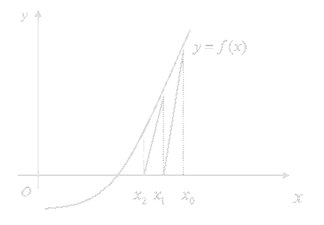

<link rel='stylesheet' href='../../style/index.css'>

# [数值分析：非线性方程组迭代法](./index.html)

[TOC]

## 二分法

**缺点**

- 在区间$[a,\,b]$的根多于一个时，二分法也只能找出一个。
- 若区间$[a,\,b]$内有重根时，也未必满足$f(a)⋅f(b)<0$。

## 不动点迭代

### 构造思路

>迭代法构造思路：将$Ax=b$等价改写为$x=Mx+g$

仿照迭代法思路，将$f(x)=0$等价变换为$x=φ(x)$。

$$x_{k+1} = φ(x_k), \,\,\,k=0,1,2,\cdots$$

- $φ(x)$：迭代函数

### 收敛条件

1. $∀x∈[a,b]$，有$φ(x)∈[a,b]$
2. $∃L∈[0,1]$，$∀x,y∈[a,b]$，有$|φ(x)-φ(y)|≤L|x-y|$
   - $L$称为**利普希茨（Lipschitz）常数**
3. $∃L∈[0,1]$， $∀x∈[a,b]$,有$|φ'(x)|≤L<1$

满足以上任意一条（2、3本质是一条），则可得到。

$∀x_0∈[a,b]$，由$x_{k+1}=φ(x_k)$得到的序列收敛于$φ(x)$在$[a,b]$上的唯一不动点。

### 误差估计式

简单迭代法的收敛性不但取决于迭代函数$\varphi(x)$，还取决于$x_0$。

**事后估计**

$|x^* - x_k| ≤ \dfrac{1}{1-L}|x_k - x_{k-1}|$

- 终止准则：$\dfrac{|x_k - x_{k-1}|}{1+|x_k|} < \varepsilon$

**先验估计**

$|x^* - x_k| ≤ \dfrac{L^k}{1-L}|x_1 - x_0|$

- 终止准则：$k > \dfrac{\ln \left( 
        \dfrac{
            (1-L)\varepsilon
        }{
            x_1 - x_0
        }
    \right)
}{\ln L}$

### 局部收敛性

设$x^*$为方程$x=φ(x)$的根，$φ'(x)$在$x^*$的领域连续，且$|\varphi'(x^*)|<1$，则迭代过程$x_{k+1}=φ(x_k)$在根$x^*$领域具有局部收敛性。

### 收敛阶

设$x^*$是$φ(x)$的不动点，对于整数$p>1$，迭代函数$φ(x)$及其$p$阶导数在$x^*$的领域上连续，且满足：

$$φ'(x^*) = φ''(x^*) = \cdots = φ^{(p-1)}(x^*) = 0, \,\,\, φ^{(p)}(x^*)≠0$$

则迭代过程$x_{k+1} = φ(x_k)$在$x^*$的领域是 **$p$阶收敛的**，且有

$$\lim\limits_{k→∞} \dfrac{e_{k+1}}{(e_k)^p} = \dfrac{φ^{(p)}(x^*)}{p!} = C$$

- $e_k = |x^* - x_k|$：迭代误差
- $C$：渐进误差常数

也就是迭代过程的收敛速度依赖于迭代函数$\varphi(x)$的选取。

- $p=1$时，为**线性收敛**
- $p=2$时，为**平方收敛**
- $p>1$时，为**超线性收敛**

#### 例

$x_{k+1} = x_k + c(x_k^2 - 5)$，收敛到$\sqrt{5}$（$x^*=\sqrt{5}$）

1. $c$的取值时，收敛（局部收敛性）
2. $c$取何值时，满足平方收敛
3. $c$取何值时，收敛最快

**解**

| |
| - |
| $\varphi(x) = x + c(x^2 - 5)$ |
| $\varphi'(x) = 1 + 2cx$ |
| $\varphi''(x) = 2c$ |

(1)

- $|\varphi'(x^*)|<1 { \ \ \ ⇒ \ \ \ } -\dfrac{\sqrt{5}}{5}<c<0$

(2)

- 明显$\varphi''(x) ≠ 0$
- 当$\varphi'(x^*) = 0$时，$c=-\dfrac{\sqrt{5}}{10}$
- 故当$c=-\dfrac{1}{2\sqrt{5}}$，至少平方收敛到$\sqrt{5}$

(3)

- 最高仅能保证平方收敛，故$c=-\dfrac{1}{2\sqrt{5}}$时收敛最快

### 迭代加速

**艾特金（Aitken）**

$$\hat{x}_{k+1} = x_k - \dfrac{(x_{k+1}-x_k)^2}{x_{k+2}-2x_{k+1}+x_k} { \ \ \ } k=0,1,2,\cdots$$

该方法可以将一个线性收敛的序列$\{x_k\}$转化为平方收敛的序列$\{\hat{x}_k\}$。

**斯蒂芬森（Steffensen）**

把Aitken加速法的加速技巧与原迭代$x_{k+1} = φ(x_k)$相结合

$$
\begin{cases}
    y_k = φ(x_k)
\\  z_k = φ(y_k)
\\  x_{k+1} = x_k - \dfrac{(y_k - x_k)^2}{z_k - 2y_k + x_k}
    & k=0,1,2,\cdots
\end{cases}
$$

亦可记作

$$x_{k+1} = \psi(x) { \ \ \ } k=0,1,2,\cdots$$

- $\psi(x) = x - \dfrac{
    (\varphi(x) - x)^2
}{
    \varphi(\varphi(x)) - \varphi(x) + x
}$

说明

- 不论原迭代是否收敛，只要$φ'(x^*)≠1$，则Steffensen方法至少是平方阶收敛的（$p≥2$）。
- 若原迭代是$p$阶收敛的，则Steffensen是$p+1$阶收敛的。

#### 例

求$f(x) = x^3 + 2x - 5=0$的根，用斯蒂芬森迭代法构造。

**解**

取$\varphi(x)=\sqrt[3]{5-2x}$

$\begin{cases}
    y_k = \sqrt[3]{5-2x_k}
\\  z_k = \sqrt[3]{5-2y_k}
\\  x_{k+1} = x_k - \dfrac{(y_k - x_k)^2}{z_k - 2y_k + x_k}
    & k=0,1,2,\cdots
\end{cases}$

## 牛顿迭代

### 构造思路

>**泰勒公式**：$f(x) = \dfrac{f(x_0)}{0!} + \dfrac{f'(x_0)}{1!}(x-x_0) + \dfrac{f''(x_0)}{2!}(x-x_0)^2 + \cdots + \dfrac{f^{(n)}(x_0)}{n!}(x-x_0)^n + R_n(x)$

取$x_0$作为初始近似值，将$f(x)$在$x_0$做一阶*Taylor*展开：

$$f(x) = f(x_0) + f'(x_0)(x-x_0) + \dfrac{f''(ξ)}{2!}(x-x_0)^2$$

其中$\dfrac{f''(ξ)}{2!}(x-x_0)^2$是高阶小量，故只取前两项线性部分，**利用线性方程来近似替代非线性方程**。

$$0 = f(x^*) ≈ f(x_0) + f'(x_0)(x^*-x_0)$$

**牛顿迭代公式**

$$x_{k+1} = x_k - \dfrac{f(x_k)}{f'(x_k)}, \,\,\, k=0,1,\cdots$$

**几何意义**

切线渐进

### 收敛性

<!-- 记

- $c=\dfrac{M_2}{2m_1}$
- $M_2 = \max|f''(x)|$
- $m_1 = \min|f'(x)|$

则$|x_{k+1}|≤C|x_k-x^*|^2$。
故$C|x_{k+1}-x^*| ≤ (C|x_{k}-x^*|)^2 ≤ \cdots ≤ (C|x_{0}-x^*|)^{2^{k+1}}$
可见当$C|x_{k+1}-x^*|<1$，即

$$|x_0-x^*|<\dfrac{2m_1}{M_2}$$

时，该迭代法是收敛的。 -->

- 在单根附近，平方收敛
- 在重根附近，线性收敛
- 当已知根的重数$m$时，可构造$x_{k+1} = x_k - m\dfrac{f(x_k)}{f'(x_k)}$，此时可达局部平方收敛。

### 牛顿下山法

如果$x_0$距离$x^*$比较远的话，可能导致牛顿是迭代法是发散的，为使得$x_0$影响降到最低，使用牛顿下山法。

**定义**

满足$|f(x_{k+1})|<|f(x_{k})|$即具有单调性的牛顿迭代法，称为**牛顿下山法**。

**构造思路**

若由$x_k$得到的$x_{k+1}$不能使$|f|$减小，则再$x_k$和$x_{k+1}$之间找一个更好的点$\overline{x_{k+1}}$，使得$|f(\overline{x_{k+1}})|<|f(x_k)|$。

$$\overline{x_{k+1}} = λ\left[{ x_k - \dfrac{f(x_k)}{f'(x_k)} }\right] + (1-λ)x_k = x_k - λ\dfrac{f(x_k)}{f'(x_k)}$$

当$λ=1$（此时就是牛顿迭代法）代入效果不好时，将$λ$减半计算。

### 简化法

$$x_{k+1} = x_k - \dfrac{f(x)}{M} \,\,\, k=0,1,2,\cdots$$

其中$M$为常数。该方法只具有线性收敛。

### 割线法

$$x_{k+1} = x_k - \dfrac{f(x_k)}{f(x_k) - f(x_{k-1})}(x_k - x_{k-1}), \,\,\, k=1,2,3,\cdots$$

割线法收敛阶为$p=\dfrac{1+\sqrt{5}}{2} ≈ 1.618$。

### 重根法

<!-- 求$f(x)=0$的$m$重根的平方收敛迭代法

$$
x_{k+1} = x_k - \dfrac{
    f(x_k)^{\frac{1}{m}}
}{
    \dfrac{1}{m}
    f(x_k)^{\frac{1}{m}-1}
    f'(x_k)
}
= x_k - m\dfrac{f(x_k)}{f'(x_k)}
, \ \ \ k=0,1,2,\cdots
$$

将$u(x) = \dfrac{f(x)}{f'(x)} = \dfrac{(x-x^*)h(x)}{mh(x)+(x-x^*)h'(x)}$带入上式，得： 

$$
x_{k+1} = x_k - \dfrac{u(x_k)}{u'(x_k)}
= x_k - \dfrac{f(x_k)f'(x_k)}{f'(x_k)^2 - f(x_k)f''(x_k)}
, \ \ \ k=0,1,2,\cdots
$$
-->

$$
x_{k+1} = x_k - \dfrac{f(x_k)f'(x_k)}{f'(x_k)^2 - f(x_k)f''(x_k)}
, \,\,\, k=0,1,2,\cdots
$$

上式用于求方程$f(x)=0$重根的具有平方收敛的迭代法，且不需要知道根的重数。