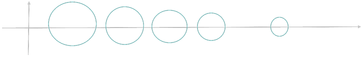

<link rel='stylesheet' href='../../style/index.css'>

# [特征值和特征向量](./index.html)

[TOC]

>[线性代数的本质：特征值和特征向量](https://www.bilibili.com/video/av6540378)

$$Aλ=λξ, \ \ \ \ \ \ ξ \neq 0$$

## 定义

$Aλ=λξ, \ \ \ ξ \neq 0$

$\begin{array}{l}
    ⇒ & λEξ-Aξ = 0
\\
\\  ⇒ & (λE-A)ξ = 0
\\
\\  ⇒ & |λE-A| = 0
\\
\end{array}$

| 特征值 | 特征向量 | 特征多项式 | 特征方程 |
| :-: | :-: | :-: | :-: |
| $λ$ | $ξ$ | $\vert{λE-A}\vert$ |  $\vert{λE-A}\vert=0$

**特征多项式**

$$\begin{array}{l}
    |{λE-A}|
    \\ \\
\end{array}
\begin{array}{l}
\\  = \sum\limits_{k=0}^{n} (-1)^k tr^{[k]} (A) λ^{n-k}
\\
\\  =  λ^n - tr^{[1]}(A)λ^{n-1} + \cdots + (-1)^n|A|
\end{array}$$

**性质**

- $\sum_{i=1}^{n}λ_i = tr(A) = \sum\limits_{i=1}^{n}a_{ii}$
- $\prod_{i=1}^{n}λ_i=|A|$
- 不同特征值的特征向量线性无关

## 重数

**几何重数**

如果$A$的属于特征值$λ_s$的线性无关特征向量有$s$个，则称特征值$λ_s$的**几何重数**是$s$。

**代数重数**

如果$λ_m$是$A$的特征方程$|λE-A| = 0$的$m$重根，则称特征值$λ_m$的代数重数是$m$。

## 相似对角化

若$A$相似于对角阵（记作$A∼Λ$），则称$A$可相似对角化，称$A$为**单纯矩阵**。

**充要条件**

- $A$有$n$个线性无关的特征向量${ \ \ \ ⇔ \ \ \ }A$可相似对角化

**充分条件**

- $A$有$n$个不同的特征值${ \ \ \ ⇒ \ \ \ }A$可相似对角化
- $λ_i$是矩阵$A$的$m_i$重特征值，且满足$m_i = n-r(A-λ_iE){ \ \ \ ⇒ \ \ \ }A$可相似对角化

## 圆盘定理

>$|a+bi| = \sqrt{a^2 + b^2}$

### 定理

以矩阵第$i$行第$i$个元素的$(a,b)$为圆心（$a$为元素实部、$b$为元素虚部），第$i$行其它元素的模的和为半径，刻画⚪（实边）到复平面上。则$n$阶矩阵可画$n$个圆盘。

**定理1**

特征值属于所有⚪的并集。

**定理2**

每个连续的独立的部分，有几个⚪就有几个特征值。

### 性质

- $n$个圆盘都不相交${ \ \ \ ⇒ \ \ \ }A$可相似对角化
- 若$A$为实矩阵，对特征多项式进行分解
  - 分解出一个一次项，出来一个实根
  - 分解出一个二次项，出现一对虚根，即**实矩阵虚根一出出一对**
- $n$个圆盘都不相交且$A$是实矩阵${ \ \ \ ⇒ \ \ \ }A$的特征值全是实数

#### 例1

$$A = \left[\begin{array}{c}
        1             & -\dfrac{1}{2} & -\dfrac{1}{2} & 0
\\\\    -\dfrac{1}{2} & \dfrac{3}{2}  & i             & 0
\\\\    0             & -\dfrac{i}{2} & 5             & \dfrac{i}{2}
\\\\    -1            & 0             & 0             & 5i
\end{array}\right]$$

画出矩阵$A$的圆盘图

**解**

#### 例2

$$A_{4×4} = \left[\begin{array}{c}
    9 & 1 & -2 & 1
\\  0 & 8 & 1  & -4
\\ -1 & 0 & 4  & 0
\\  2 & 0 & 0  & -1
\end{array}\right]$$

证明$A$至少有两个实根。

**解**

$A$为实矩阵，所以

$$|{λE-A}| = λ^4 + a_2λ^3 + a_3λ^2 + a_4λ + |A|$$

为实系数多项式。

左侧仅有一个根，且必为实根（因为虚根成对出现）。

右侧有三个根，可能存在如下两种情况

- 2虚1实
- 3实

综上，$A$至少有两个实根。

#### 例3

$$A = \left[\begin{array}{c}
    4             & \frac{1}{4}       & (\frac{1}{4})^2 & \cdots & (\frac{1}{4})^{n-1}
\\
\\  \frac{1}{5}   & 5                 & (\frac{1}{5})^2 & \cdots & (\frac{1}{5})^{n-1}
\\
\\  \frac{1}{6}   & (\frac{1}{6})^2   & 6               & \cdots & (\frac{1}{6})^{n-1}
\\
\\  \vdots        & \vdots            & \vdots          & \ddots & \vdots
\\
\\  \frac{1}{n+3} & (\frac{1}{n+3})^2 & \cdots          & (\frac{1}{n+3})^{n-1} & n+3
\end{array}\right]$$

证明矩阵$A$所有特征值都为实数，且可逆，可相似对角化。

**解**

>- 等比数列前$n$项和：$S_n = a_1 \dfrac{1 - r^n}{1 - r}$
>- $1 + r + r^2 + \cdots + r^{n-1} = \dfrac{1 - r^n}{1 - r}$
>- $r + r^2 + \cdots + r^{n-1} = \dfrac{r - r^n}{1 - r}$

- $S_4(n-1) = \dfrac{1}{4} + (\dfrac{1}{4})^2 + (\dfrac{1}{4})^3 + \cdots + (\dfrac{1}{4})^{n-1} 
    = \dfrac{
        \dfrac{1}{4} - (\dfrac{1}{4})^{n}
    }{
        1 - \dfrac{1}{4}
    }
    = \dfrac{1}{3} ( 1 - \dfrac{1}{4^{n-1}} ) < \dfrac{1}{3} < 1
$
- $S_5(n-1) = \dfrac{1}{5} + (\dfrac{1}{5})^2 + (\dfrac{1}{5})^3 + \cdots + (\dfrac{1}{5})^{n-1} = 
    \dfrac{
        \dfrac{1}{5} - (\dfrac{1}{5})^{n}
    }{
        1 - \dfrac{1}{5}
    }
    = \dfrac{1}{4} ( 1 - \dfrac{1}{5^{n-1}} ) < \dfrac{1}{4} < 1
$
- $S_i(n-1) = \dfrac{1}{i-1} ( 1 - \dfrac{1}{i^{n-1}} ) < \dfrac{1}{i-1} < 1$

故可以画出圆盘图如下图所示

$n$个圆盘互不相交，$n$个行圆盘均在右半平面即不包含原点。

所以$A$有个$n$个互不相同的实特征值，故$A$可逆且可相似对角化。