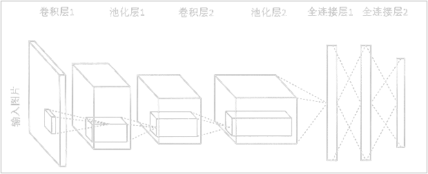
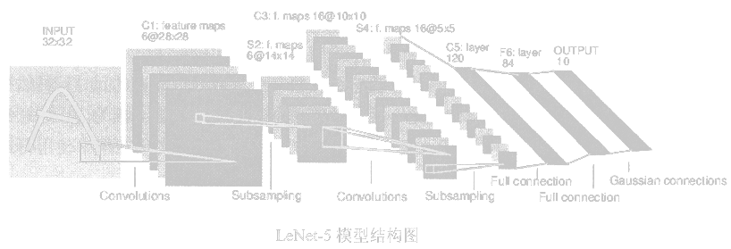
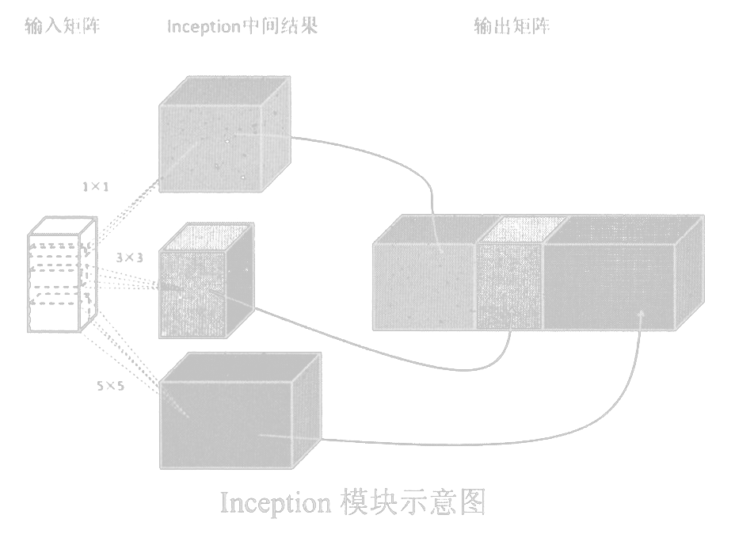

<link rel='stylesheet' href='../../style/index.css'>

# [机器学习：CNN](./index.html)

[TOC]

## 初识卷积神经网络

卷积的目的是从输入的图片当中提取特征。

### 卷积层（Convolution）

卷积层试图将神经网络中的每一小块进行更加深入地分析从而得到抽象程度更高的特征。一般来说，通过卷积层处理过的节点矩阵会变得更深。

#### 过滤器（Filter）

- **过滤器的参数深度**：与输入数据深度是一致的。
- **过滤器尺寸**：输入节点矩阵的大小，一般为`3×3`、`5×5`。
- **过滤器深度**：输出单位节点矩阵的深度。

$$ReLU\left(\left(\sum\limits_{i=1}^{deep} area_i \bullet filter_i\right) + bias\right)$$

过滤器每层与输入数据每层求内积（对应点相乘并求和）加上偏置项就得到输出矩阵上的一个点。

}$，若过滤器数为$Filter_{(size=L×L, step=S, padding=P, deep=N)}$，则输出$Output_{(W, H, D)}$的属性为：

- $Output.W = \dfrac{W-L+2P}{S} + 1$
- $Output.H = \dfrac{H-L+2P}{S} + 1$
- $Output.D = N$

#### 扩展卷积

<!-- https://www.cnblogs.com/yangperasd/p/7071657.html -->

### 池化层（Pooling）

池化层不会改变矩阵的深度，但是可以缩小矩阵的大小。

#### 方法

- 最大值（max pooling）
- 平均值（average pooling）

#### 最大值法

## LeNet-5

- 串联卷积

## Inception-v3

- 并联卷积

## 迁移学习

所谓迁移学习，就是将一个问题上训练好的模型通过简单的调整使其适用于一个新的问题。
比如：可以保留训练好的Inception-v3模型中所有卷积层的参数，只是替换最后一层全连接层。在最后这一层全连接层之前的网络层称之为**瓶颈层（bottleneck）**。
一般来说，在数据量足够的情况下，迁移学习的效果不如完全重新训练。