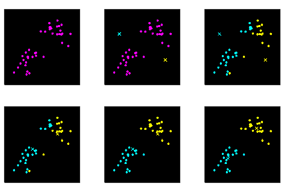

<link rel='stylesheet' href='../../style/index.css'>

# [机器学习：聚类](./index.html)

[TOC]

## 基本概念

>[Sklearn-Clustering](https://scikit-learn.org/stable/modules/clustering.html)

将数据分组成簇，使得簇内相似度尽可能高，簇间相似度尽可能低的无监督学习方法。

### 常见聚类算法

<!-- 【参考资料】
《各种聚类算法介绍和比较》
    https://blog.csdn.net/u013185349/article/details/82386113

 -->

- **Partition-based methods**
  - K-Means
- **Density-based methods**
  - DBSCAN
  - OPTICS（Ordering points to identify the clustering structure）
- **Hierarchical methods**
  - Ward（凝聚法层次聚类）
  - BIRCH（Balanced Iterative Reducing and Clustering Using Hierarchies）
  - Chameleon
  - Agglomerative
- **Grid-based methods**
  - STING（STatistical INformation Grid）
  - WAVE-CLUSTER
  - CLIQUE（CLustering In QUEst）
- **Model-based methods**
  - GMM（Gaussian Mixture Models）
  - SOM（Self Organized Maps）
- **Fuzzy-based methods**
  - FCM
- **Other methods**
  - SLC（Sequential Leader Clustering）
  - Spectral

## K-Means

### 特点

**优点**

- 收敛速度快（5步左右）

**缺点**

- 要求用户必须事先给出要生成的簇的数$k$
- 对噪音和异常点比较的敏感
- 非凸的数据集比较难收敛
- 最终可能只是局部最优解

### 原理

对于给定的样本集，按照样本之间的距离大小，将样本集划分为$k$个簇。让簇内的点尽量紧密的连在一起（$E$尽可能小），而让簇间的距离尽量的大。

$$E = \sum_{i=1}^{k} \sum_{x∈C_i}
    \| x - μ_i\|_2^2
$$

- $k$：样本被划分为$k$个簇
- $C_i$：簇划分为$\{ C_1, C_2, \dots, C_k \}$
- $μ_i$：簇$C_i$的均值向量，$μ_i = \dfrac{1}{|C_i|} \sum\limits_{x∈C_i} x$

### 流程

- 输入：$k$、$D=\{x_1,x_2,\dots,x_m\}$
  - $i=1,2,\dots,m$
  - $j=1,2,\dots,k$
- ***Step1***：从数据集$D$中随机选择$k$个样本作为初始的质心向量$\{μ_1, μ_2, \dots, μ_k\}$
- ***Step2***：把每个样本分配到距离它最近的质心形成的簇
  - $C_j = \empty$
  - $d_{ij} = \|x_i - μ_j\|_2$
  - 选出距离最近的$C_{λ_i}$作为$x_i$的簇，$λ_i = (\min\limits_{j=1,2,\dots,k} d_{ij}).j$
  - 将$x_i$加入到簇，$C_{λ_i} = C_{λ_i} \bigcup x_i$
- ***Step3***：重新计算均值向量
  - $μ_j' = \dfrac{1}{|C_j|} \sum\limits_{x∈C_j} x$
  - $μ_j = μ_j'$
- 重复*Step2*、*Step3*直到满足要求
- 输出：$C=\{C_1,C_2,\dots,C_k\}$

**迭代过程**

## Ward Hierarchical Clustering

### 思想

凝聚的层次聚类采用自底向上策略，首先将每个样本作为一个簇，然后合并这些原子簇形成越来越大的簇，以减少簇的数目，直到所有的样本都在一个簇中，或某个终结条件被满足。

### 距离判定

||||
| - | - | - |
| **单链接（Single Linkage）**   | 最小距离 | 两个簇的最近样本决定 |
| **全链接（Complete Linkage）** | 最大距离 | 两个簇的最远样本决定 |
| **均链接（Average Linkage）**  | 平均距离 | 两个簇所有样本共同决定 |

