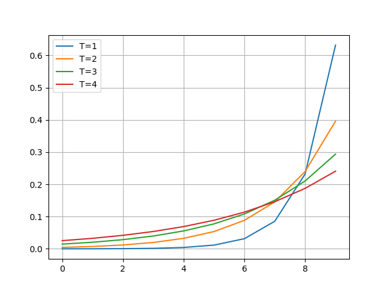
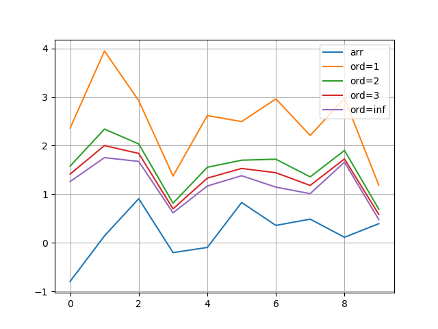
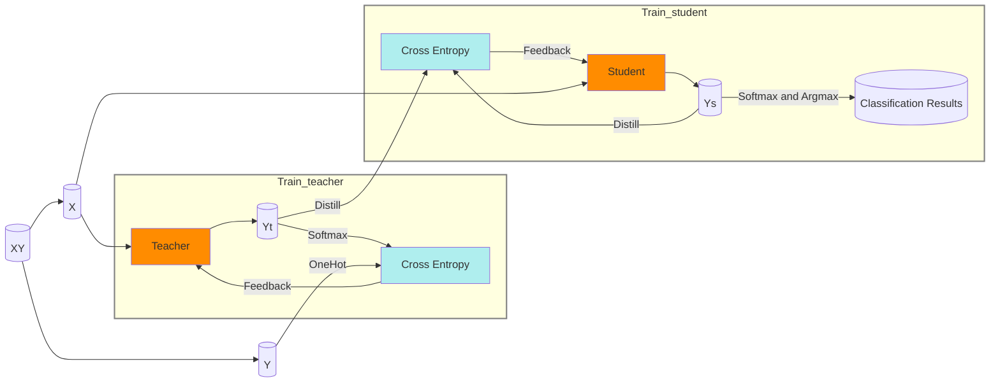

<link rel='stylesheet' href='../../style/index.css'>
<script src='../../style/index.js'></script>

# [知识蒸馏（Distilling the Knowledge）](./index.html)

[TOC]

## 基本概念

知识蒸馏是一种基于**教师—学生网络**的模型压缩方法。在得到一个效果较好的**Teacher**模型的基础上，将**Teacher**的输出（knowledge）作为**Student**模型的监督信息（label）对**Student**进行训练，从而得到

- 资源（计算、内存等）依赖低
- 推断速度快
- 泛化能力强

的**Student**模型。

## Softmax

$$
    \mathrm{Softmax}\left(
        \left[\begin{array}{c}
            a_1 \\ a_2 \\ \vdots \\ a_n
        \end{array}\right]
    \right)
    =
    \left[\begin{array}{c}
        \dfrac{e^{a_1}}{\sum_{i=1}^{n}e^{a_i}}
    &   \dfrac{e^{a_2}}{\sum_{i=1}^{n}e^{a_i}}
    &   \cdots
    &   \dfrac{e^{a_n}}{\sum_{i=1}^{n}e^{a_i}}
    \end{array}\right]^T
$$

```python
def softmax(x: np.ndarray):
    es = np.exp(x)
    return es / np.sum(es)

```

## 蒸馏函数

$$
    q_i = \dfrac{
        e^{(a_i/T)}
    }{
        \sum_{i=1}^{n}e^{(a_i/T)}
    }
$$

```python
import numpy as np
from matplotlib import pyplot as plt


def distill(x: np.ndarray, T: int):
    es = np.exp(x / T)
    return es / np.sum(es)


if __name__ == '__main__':
    arr = np.arange(10)
    plt.plot(distill(arr, 1), label="T=1")
    plt.plot(distill(arr, 2), label="T=2")
    plt.plot(distill(arr, 3), label="T=3")
    plt.plot(distill(arr, 4), label="T=4")
    plt.grid()
    plt.legend()
    plt.show()

```



原来的$\mathrm{Softmax}$函数是$T = 1$的特例。$T$越高，$\mathrm{Softmax}$的**输出概率分布**越趋于平滑（soft）。

## 正则函数

$$
    \mathrm{Norm}_{ord}
    \left(
        \left[\begin{array}{c}
            x_1 \\ x_2 \\ \vdots \\ x_n
        \end{array}\right]^T
    \right)
    =
    \left\|
        \left[\begin{array}{c}
            x_1 \\ x_2 \\ \vdots \\ x_n
        \end{array}\right]^T
    \right\|_{ord}
    =
    \sqrt[ord]{ \sum_{i=1}^{n} {x_i^{ord}} }
$$

```python
import numpy as np
from matplotlib import pyplot as plt


if __name__ == '__main__':
    arr = np.random.randn(10, 3)
    plt.plot(np.mean(arr, axis=1), label="arr")
    plt.plot(np.linalg.norm(arr, ord=1, axis=1), label="ord=1")
    plt.plot(np.linalg.norm(arr, ord=2, axis=1), label="ord=2")
    plt.plot(np.linalg.norm(arr, ord=3, axis=1), label="ord=3")
    plt.plot(np.linalg.norm(arr, ord=np.inf, axis=1), label="ord=inf")
    plt.grid()
    plt.legend()
    plt.show()

```



## 蒸馏过程


