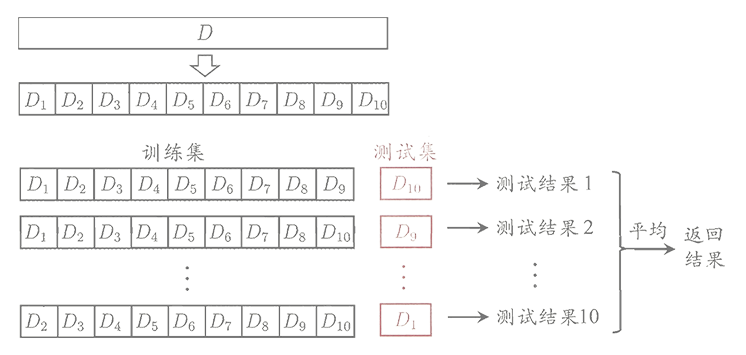
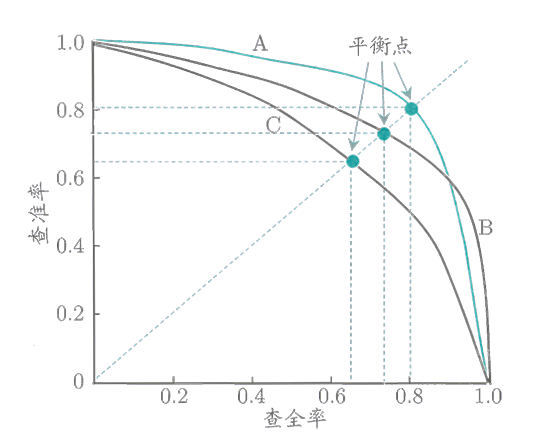
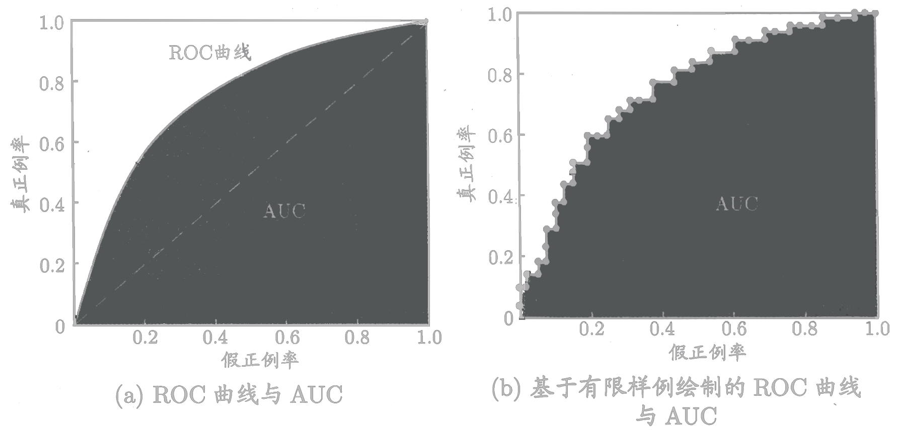

<link rel='stylesheet' href='../../style/index.css'>

# [机器学习：模型评估](./index.html)

[TOC]

## 拟合

### 过拟合（Overfitting）

略

### 欠拟合（Underfitting）

略

## 模型评估方法

### 留出法（Hold-out）

直接将数据集划分为两个互斥地集合，其中一个集合作为训练集，另一个作为测试集。在使用时，一般要采用若干次随机划分，重复进行实验，评估后取平均值作为结果。

### 交叉验证法（Cross Validation）

### 自助法（Bootstrapping）

假定包含$m$个样本的数据集$D$，每次从$D$中随机挑选一个样本，将其拷贝入$D'$，重复$m$次，就得到了包含$m$个样本的数据集$D'$。显然，$D$中的一部分样本会在$D'$中多次出现，一部分样本不会在$D'$中出现。该方法在数据集较小，难以有效划分训练集、测试集时很有用，但会引入估计偏差。

## 性能度量

- $m$：样本数
- $f(x_i)$：预测值
- $y_i$：真实值
- $Ⅱ(.)$：$Ⅱ(true)=1$、$Ⅱ(false)=0$

### 均方误差（Mean squared error）

$$E = \dfrac{ \sum\limits_{i=1}^{m} [f(x_i) - y_i]^2 }{m}$$

回归任务最常用的性能度量方法。

### 错误率与精度

**错误率**

$$E = \dfrac{ \sum\limits_{i=1}^{m} Ⅱ[f(x_i)≠y_i] }{m}$$

**精度**

$$Acc = \dfrac{ \sum\limits_{i=1}^{m} Ⅱ[f(x_i)=y_i] }{m}$$

### 混淆矩阵

| 真实情况 | 预测为正例（Positive） | 预测为反例（Negatie） |
|-|-|-|
| 正例（True）  | 真正例（TP） | 伪反例（FN）
| 反例（False） | 伪正例（FP） | 真反例（TN）

- $m = TP + FP + TN + FN$
- $Positive = TP + FP$
- $True = TP + FN$

**精确率（查准率）**

$$Precision = \dfrac{TP}{Positive}$$

**召回率（查全率）**

$$Recall = \dfrac{TP}{True}$$

**平衡点（BEP，Break-Even Point）**

查准率和查全率是一对矛盾的变量，平衡点就是查准率等于查全率时的取值。

**$F1-Score$**

$$F1 = \dfrac{2 ⋅ Precision⋅Recall}{Precision + Recall} = \dfrac{2TP}{2TP + FN + FP}$$

$F1$是基于查准率和查全率的调和平均数。

***$F_β$***

$$F_β = \dfrac{(1+β^2) ⋅ P ⋅ R}{(β^2 ⋅ P) + R}$$

$F_β$是基于查准率和查全率的加权调和平均数。

### ROC、AUC

