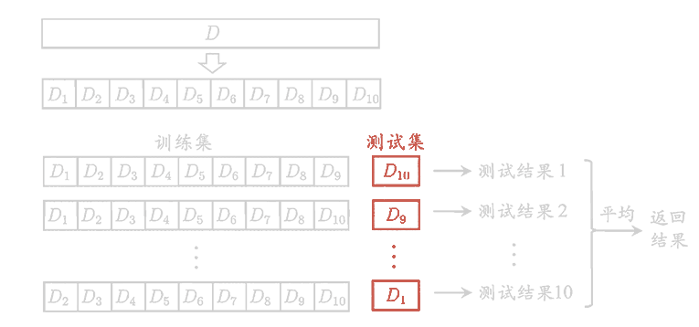
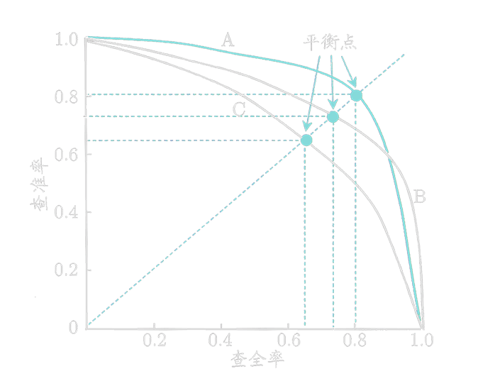
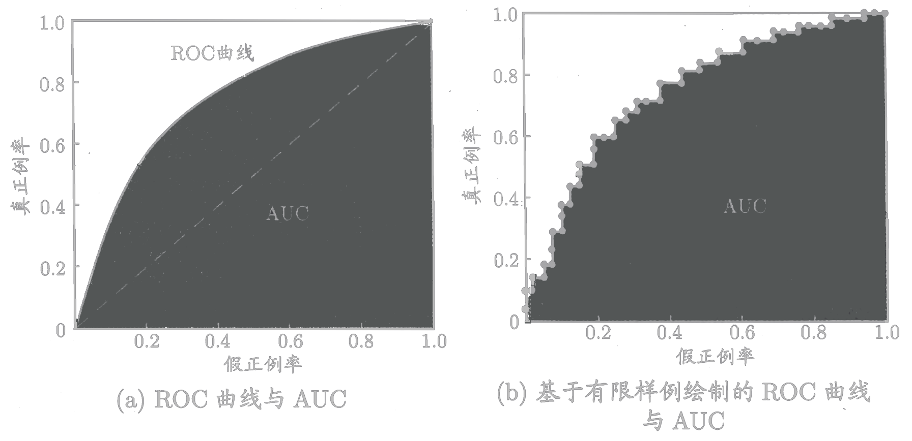
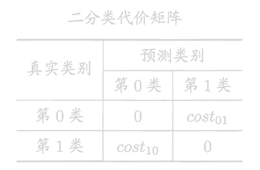
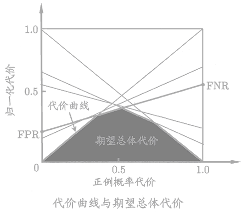
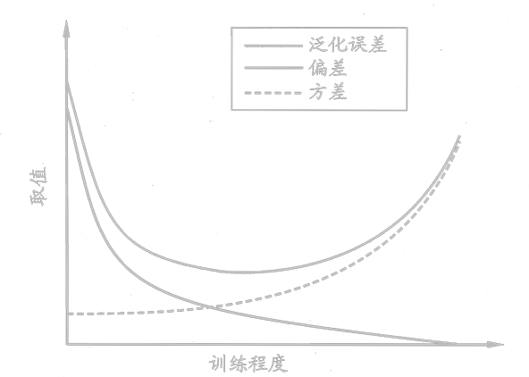

<link rel='stylesheet' href='../../style/index.css'>

# [机器学习：模型评估](./index.html)

[TOC]

## 拟合

### 过拟合（Overfitting）

略

### 欠拟合（Underfitting）

略

## 模型评估方法

### 留出法（Hold-out）

直接将数据集划分为两个互斥地集合，其中一个集合作为训练集，另一个作为测试集。在使用时，一般要采用若干次随机划分，重复进行实验，评估后取平均值作为结果。

### 交叉验证法（Cross Validation）

### 自助法（Bootstrapping）

假定包含$m$个样本的数据集$D$，每次从$D$中随机挑选一个样本，将其拷贝入$D'$，重复$m$次，就得到了包含$m$个样本的数据集$D'$。显然，$D$中的一部分样本会在$D'$中多次出现，一部分样本不会在$D'$中出现。该方法在数据集较小，难以有效划分训练集、测试集时很有用，但会引入估计偏差。

## 性能度量

### 回归问题

#### 均方误差（Mean squared error）

$$\mathrm{MSE}(y, f) = \dfrac{
    \sum\limits_{i=1}^{m} \Big(y_i-f(x_i) \Big)^2
}{m}$$

- 优点是便于梯度下降，误差大时下降快，误差小时下降慢，有利于函数收敛。
- 缺点是受明显偏离正常范围的离群样本的影响较大

#### 平均绝对误差（Mean absolute error）

$$\mathrm{MAE}(y, f) = \dfrac{
    \sum\limits_{i=1}^{m} \Big| y_i-f(x_i) \Big|
}{m}$$

- 优点是其克服了MSE的缺点，受偏离正常范围的离群样本影响较小。
- 缺点是收敛速度比MSE慢，因为当误差大或小时其都保持同等速度下降，而且在某一点处还不可导，计算机求导比较困难。

### 分类问题

#### Cross Entropy

$$\mathrm{CE}(p, q) = -\sum_{x∈X} p(x)\log q(x)$$

### 错误率与精度

**错误率**

$$E = \dfrac{ \sum\limits_{i=1}^{m} Ⅱ[f(x_i)≠y_i] }{m}$$

**精度**

$$Acc = \dfrac{ \sum\limits_{i=1}^{m} Ⅱ[f(x_i)=y_i] }{m}$$

### 混淆矩阵

| 真实情况 | 预测为正例（Positive） | 预测为反例（Negatie） |
|-|-|-|
| 正例（True）  | 真正例（TP） | 伪反例（FN）
| 反例（False） | 伪正例（FP） | 真反例（TN）

- $m = TP + FP + TN + FN$

#### 准确率

$$Accuracy = \dfrac{TP+TN}{m} = \dfrac{TP+TN}{TP + FP + TN + FN}$$

#### 特异度

$$Specificity = \dfrac{TN}{False} = \dfrac{TN}{FP + TN}$$

#### 精确率（查准率）

$$Precision = \dfrac{TP}{Positive} = \dfrac{TP}{TP + FP}$$

#### 召回率（查全率）

$$Recall = \dfrac{TP}{True} = \dfrac{TP}{TP + FN}$$

#### 平衡点（BEP，Break-Even Point）

查准率和查全率是一对矛盾的变量，平衡点就是查准率等于查全率时的取值。

#### $F_1$

$$ 
\begin{array}{r}
    F_1
\\ \\ \\ \\ \\ \\ \\
\end{array} \begin{array}{l}
    = \dfrac{1}{
        \frac{1}{2} ⋅ \frac{1}{Precision} +
        \frac{1}{2} ⋅ \frac{1}{Recall}
    }
\\
\\  = \dfrac{2 ⋅ Precision⋅Recall}{Precision + Recall}
\\
\\  = \dfrac{2TP}{2TP + FN + FP}
\end{array} 
$$

$F1$是基于查准率和查全率的调和平均数。

#### $F_β$

$$ 
\begin{array}{r}
    F_β
\\ \\ \\ \\ \\
\end{array} \begin{array}{l}
    = \dfrac{1}{
        \frac{1}{β^2+1} ⋅ \frac{1}{Precision} +
        \frac{β^2}{β^2+1} ⋅ \frac{1}{Recall}
    }
\\
\\  = \dfrac{ (1+β^2) ⋅ Precision ⋅ Recall }{ β^2 ⋅ Precision + Recall }
\end{array} 
$$

$F_β$是基于查准率和查全率的加权调和平均数，当$β=1$时，即为$F_1$。

#### ROC

ROC（Receiver Operating Characteristic，受试者工作特征）曲线纵轴为“**真正例率（TPR，True Positive Rate）**”，横轴是“**假正例率（FPR，False Positive Rate）**”。

- $TPR = \dfrac{TP}{True} = \dfrac{TP}{TP + FN}$
- $FPR = \dfrac{FP}{False} = \dfrac{FP}{FP + TN} $

“**AUC（Area Under Curve）**”为ROC曲线所覆盖的区域面积。AUC越大，分类器分类效果越好。

| AUC | 效果 |
| - | - |
| $1$ | 完美分类器
| $(0.5,1)$ | 优于随机猜测
| $0.5$ | 等价于随机猜测
| $(0,0.5)$ | 差于随机猜测

## 代价

在非均等代价下ROC曲线不能反映出学习器的期望总体代价。

### 代价敏感（Cost-Sensitive）错误率

$$E = \dfrac{
    \sum\limits_{x_i∈D^+} Ⅱ(f(x_i)≠y_i) cost_{01} +
    \sum\limits_{x_i∈D^-} Ⅱ(f(x_i)≠y_i) cost_{10}
}{m}$$

- $D^+$：实例集$D$的正例子集。
- $D^-$：实例集$D$的反例子集。

### 代价曲线（Cost Curve）

横轴为“**正概率代价**”，纵轴为“**归一化代价**”。

$P(+){cost} = \dfrac{
    p ⋅ cost_{01}
}{
    p ⋅ cost_{01}  + (1-p) ⋅ cost_{10} 
}$

- $p$：样例为正例的概率。

$cost_{norm} = \dfrac{
    FNR ⋅ p ⋅ cost_{01} +
    FPR ⋅ (1-p) ⋅ cost_{10} 
}{
    p ⋅ cost_{01}  + (1-p) ⋅ cost_{10} 
}$

- $FNR = \dfrac{FN}{True}$
- $FPR = \dfrac{FP}{False}$

## 比较检验

我们希望比较的是泛化性能，然而通过实验评估方法我们获得的是测试集上的性能，两者的对比结果未必相同。

| 比较算法数量 | 检验名称 | 说明 |
| :-: | :-: | :- |
| 2 | 交叉验证$t$检验 | 
| 2 | $McNemar$检验 |
| * | $Friendman$检验 |
| * | $Nemenyi$后续检验

## 偏差

**偏差**

$$bias_i = f(x_i) - y_i$$

**方差**

$$ε^2 = \dfrac{ 
    \sum\limits_{i=1}^{m} {bias_i}^2
 }{m}$$

 ### 偏差方差窘境（Bias-Variance Dilemma）

 一般来说，偏差与方差是有冲突的，假定我们能控制学习算法的训练程度，则在训练不足时，学习器的拟合能力不够强，训练数据的扰动不足以使学习器产生显著变化，此时偏差主导了泛化错误率；随着训练程度的加深，学习器的拟合能力逐渐增强，训练数据发生的扰动渐渐能被学习器学到，方差逐渐主导了泛化错误率。

 
