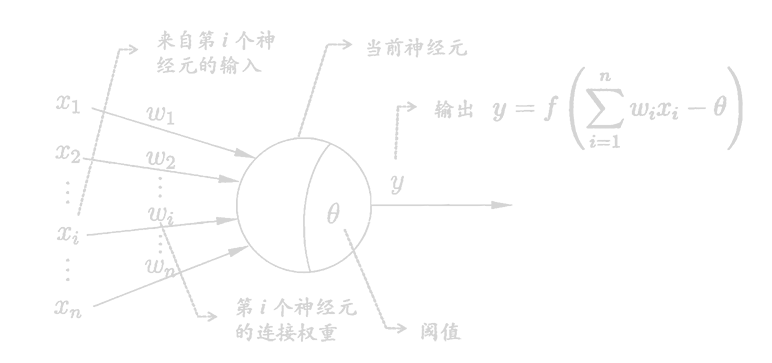
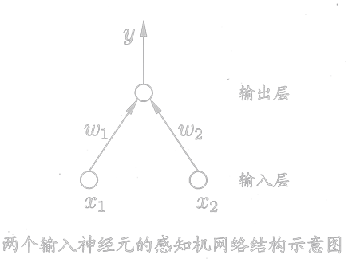
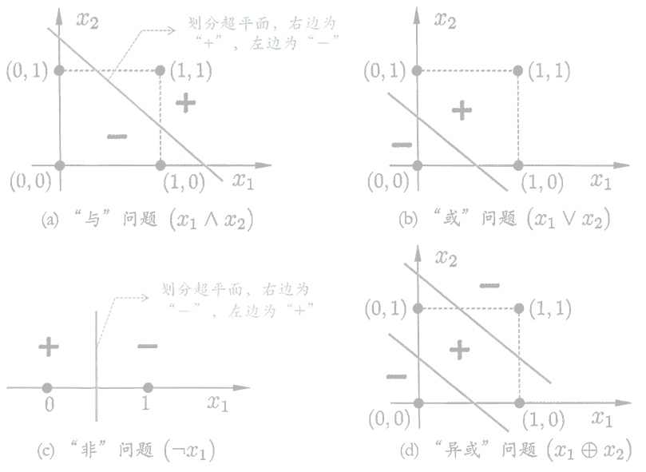
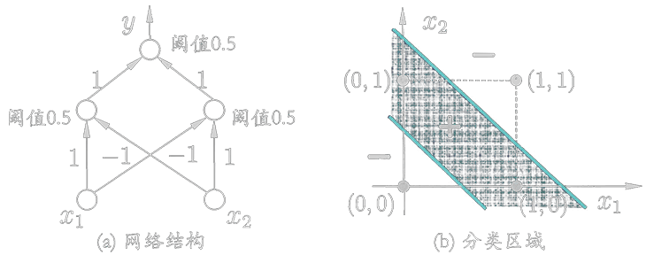
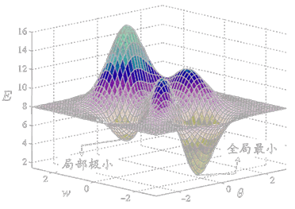

<link rel='stylesheet' href='../../style/index.css'>
<script src='../../style/index.js'></script>

# [机器学习：神经网络](./index.html)

[TOC]

## 基本神经网络

### M-P神经元



### 感知机（Perceptron）

由两层神经元组成，输出层是M-P神经元，仅有输出层神经元进行激活函数处理。



感知机模型仅能解决一个线性可划分问题，所以感知机模型不能解决异或问题。



### 隐藏层

输入层与输出层之间的一层神经元称为**隐藏层（隐含层，Hidden Layer）**。隐藏层和输出层都有激活函数处理。



以上多层神经网络可以解决异或问题。

### 多层感知器（MLP，Multilayer Perceptron）

>多层前馈神经网络（Multi-layer Feedforward Neural）


## 误差逆传播（errorBackPropagation）

BP算法基于梯度下降（Gradient Descent）策略，以目标的负梯度方向对参数进行调整。

$$Δw_{hj} = -η\dfrac{∂E_k}{∂w_{hj}}$$

- $η$：学习率，$η∈(0,1)$，过大时容易发生震荡
- $E_k$：第$k$轮训练后的均方误差
- $w_{hj}$：上一层第$h$个神经元与下一层第$j$个神经元的连接权

### 工作流程

<!-- 
    tf.truncated_normal_initializer(stddev=1)
    tf.constant_initializer(0)
-->

```flow
st=>start: 开始
init=>operation: 初始化连接权和阈值
input=>inputoutput: 输入：训练集、学习率
sub1=>operation: 前向传播：计算输出值、误差
sub2=>operation: 反向传播：计算梯度顶，更新连接权和阈值
isend=>condition: 满足训练次数 Or 满足正确率
output=>inputoutput:  输出：连接权和阈值
ed=>end: 结束

st->init->input
input->sub1->isend
isend(no)->sub2->sub1
isend(yes)->output->ed
```

## 最小值

在使用梯度下降法进行搜索时，很可能我们得到的是一个局部极小值。



一些常见的跳出局部极小值的方法

- 使用不同参数值初始化多个神经网络，取其中误差最小的解作为最终参数。
- **模拟退火技术**：每一步都有一定的概率接受次优解，随着步数增加该概率逐渐下降。
- **随机梯度下降**：计算梯度时加入随机因素，即便陷入局部极小点，其计算梯度的梯度值也不为0，使其有可能跳出继续搜索。

