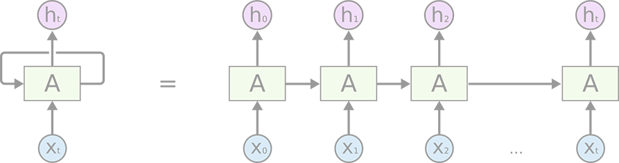
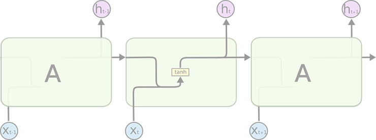
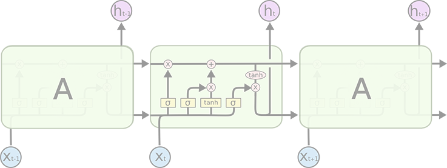
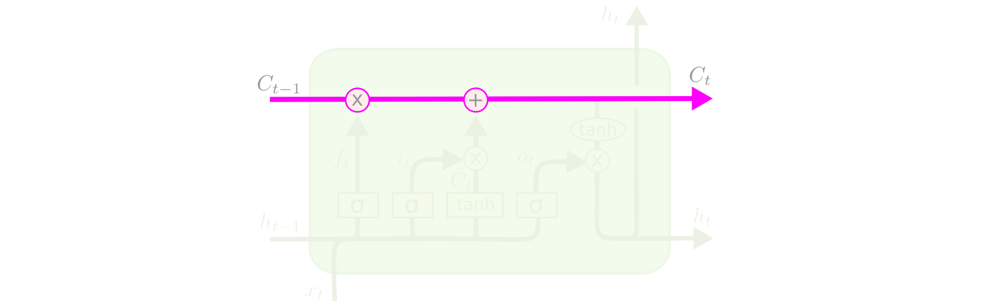
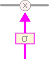
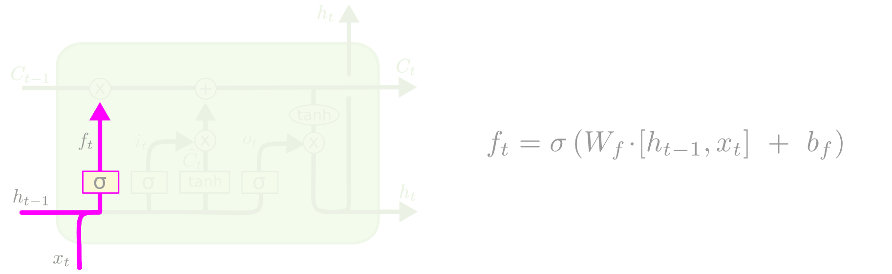
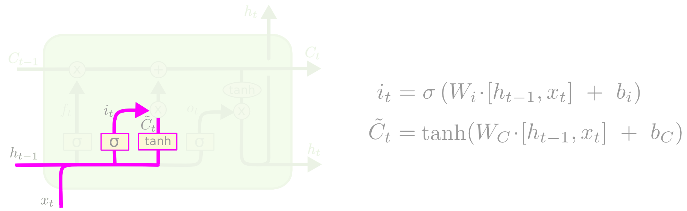
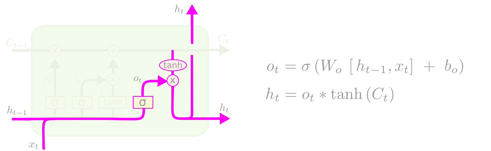

<link rel='stylesheet' href='../../style/index.css'>

<!-- http://colah.github.io/posts/2015-08-Understanding-LSTMs/ -->

# [机器学习：RNN](./index.html)

[TOC]

## 初识循环神经网络

人类不会每秒都从头开始思考！

循环神经网络会记忆之前的信息，并利用之前的信息影响后面结点的输出。也就是说，循环神经网络的隐藏层之间的结点是有连接的，隐藏层的输入不仅包括输入层的输出，还包括上一时刻隐藏层的输出。

循环神经网络可以看作是同一网络的多个副本，每个副本都将消息传递给后继者。

### 循环体

循环神经网络可以看作是同一神经网络结构在时间序列上被复制多次的结果，这个被复制多次的结构被称之为**循环体**。

如何设计循环体的网络结构是循环神经网络解决实际问题的关键。

在标准RNN中，此重复模块将具有非常简单的结构，例如单个tanh层。

### 缺陷

有时，我们只需要查看最新信息即可执行当前任务。

但是在某些情况下，我们需要更多的上下文。不幸的是，随着差距的扩大，RNN变得无法学习连接信息。

## LSTM

>
>
>- PointwiseOperation：输出介于零和一之间的数字，描述允许每个组件中的多少通过。
>- $σ$：激活函数*Sigmoid*
>- $tanh$：激活函数*Tanh*
>- $⊗$：输入部分相乘
>- $⊕$：输入部分相加
>&nbsp;

长短期记忆网络（LSTM）是一种特殊的RNN，能够学习长期依赖关系。

### 单元状态

单元状态有点像传送带。它沿整个链条一直沿直线移动，只有一些较小的线性相互作用。信息非常容易就可以不加改变地流动。

### 闸门

LSTM确实具有删除信息或将信息添加到单元状态的能力，这些信息由称为门的结构精心调节。

闸门是一种选择性地让信息通过的方式。其有以下三种门。

#### 忘记门

LSTM的第一步是决定要从单元状态中丢弃哪些信息。

#### 输入门

下一步是确定要在单元状态下存储哪些新信息。包含两部分，第一路（σ）决定更新哪些值，第二路（tanh）新建候选值向量并添加到状态中。

##### 更新旧单元状态

将单元旧状态与$f_t$相乘，然后加上$i_t × \tilde{C}_t$生成新的候选值。

#### 输出门

最后，我们需要决定要输出的内容。

