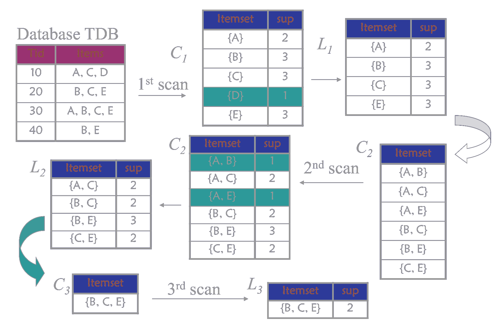
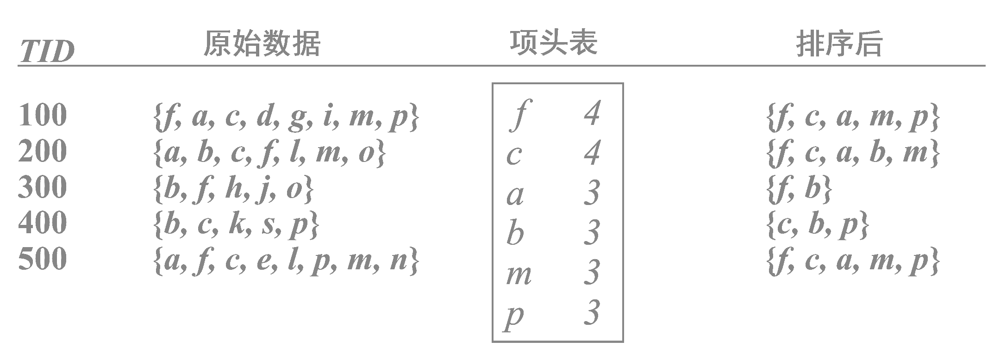

<link rel='stylesheet' href='../../style/index.css'>

# [机器学习：关联分析](./index.html)

[TOC]

## Apriori

### 频繁项集

频繁项集的评估标准有

#### 支持度

关联的数据在数据集中出现的次数占总数据集的比重

$$
    \mathrm{Support}(X) = P(X) 
        = \frac{
            \mathrm{Num}(X)
        }{
            \mathrm{Num}(Samples)
        }
$$

$$
    \mathrm{Support}(X,Y) = P(XY) 
        = \frac{
            \mathrm{Num}(XY)
        }{
            \mathrm{Num}(Samples)
        }
$$

#### 置信度

一个数据出现后，另一个数据出现的概率，即数据的条件概率（$X$在$Y$发生的条件下发生的概率）。

$$
    \mathrm{Confidence}(X ⇐ Y)
        = P(X {\ \bold|\ } Y)
        = \dfrac{
            \mathrm{Support}(X, Y)
        }{
            \mathrm{Support}(Y)
        }
        = \dfrac{
            P(XY)
        }{
            P(Y)
        }
$$

#### 提升度

$X$在$Y$发生的条件下发生的概率，与$X$总体发生的概率之比

$$
    \mathrm{Lift}(X ⇐ Y)
        = \dfrac{
            Confidence(X ⇐ Y)
        }{
            P(X)
        }
        = \dfrac{ 
            P(X {\ \bold|\ } Y)
        }{ 
            P(X)
        }
        = \dfrac{
            P(XY)
        }{
            P(X)P(Y)
        }
$$

| 提升度 | 关联强弱 |
| - | - |
| $\mathrm{Lift}(X ⇐ Y) > 1$ | $X ⇐ Y$为有效的强关联 |
| $\mathrm{Lift}(X ⇐ Y) < 1$ | $X ⇐ Y$为无效的强关联 |

要选择一个数据集合中的频繁数据集，则需要自定义评估标准。最常用的评估标准是用自定义的**支持度**，或者是自定义**支持度**和**置信度**的一个组合。

### Apriori算法

Apriori算法是常用的用于挖掘出数据关联规则的算法，它用来找出数据值中频繁出现的数据集合。

Apriori算法的目标是找到最大的$K$项频繁集。

>- 如果一个集合是频繁项集，则它的所有非空子集都是频繁项集。
>- 如果一个集合不是频繁项集，则它的所有超集都不是频繁项集。

- ***Step1***：找到符合支持度标准的频繁集
- ***Step2***：找到最大个数的频繁集

#### Example

规定最小支持计数为2

## FP-tree

随着数据库容量的增大，**Apriori算法**重复访问数据库（外存）将导致性能低下。**FP-tree算法**对此进行了改进，减少了数据库的扫描次数和侯选集空间占用。

### FP-tree算法

- ***Step1***：第一次扫描，得到所有频繁一项集的的计数。然后删除支持度低于阈值的项，将频繁一项集放入**项头表**，并按照支持度降序排列。
- ***Step2***：第二次扫描，将读到的原始数据剔除非频繁一项集，并按照支持度降序排列。
- ***Step3***：读入排序后的数据集，按序插入FP树。
- ***Step4***：从**项头表**的底部项依次向上挖掘。

#### Example

最小支持度0.5

