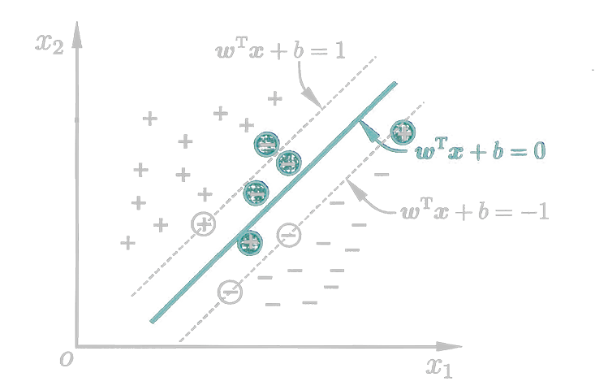

<link rel='stylesheet' href='../../style/index.css'>
<script src='../../style/index.js'></script>

# [机器学习：支持向量机](./index.html)

[TOC]

## 支持向量

>点到超平面的距离
>$$r = \dfrac{|w^T+b|}{\|w\|}$$

若超平面$(w,b)$能正确分类，对于$(x_i,y_i)∈D$有

$$\begin{cases}
    w^Tx_i + b ≥  1 & y_i=+1
\\  w^Tx_i + b ≤ -1 & y_i=-1
\end{cases}$$

距离超平面最近的几个训练样本上的点使上式成立，被称为**支持向量（SV，Support Vector）**。训练完成后，大部分样本都不需要保留，最终模型仅与支持向量有关。

**注**：此处我们人为的规定了$\begin{matrix}
    w^Tx_i + b = ±1 & x_i∈SV
\end{matrix}$。

两个异类支持向量到超平面的距离和称作**间隔（Margin）**

$$γ = \dfrac{2}{\|w\|}$$


## 原问题

寻找最大间隔$γ$等效于寻找最小的$\|w\|^2 = w^Tw$

$$\begin{cases}
    \min\limits_{w,b} \dfrac{1}{2} w^Tw
\\
\\  y_i(w^Tx_i + b) ≥ 1 \begin{matrix}\\\end{matrix}
\end{cases}$$

上式即为**支持向量机（Support Vector Machine）的基本型**。这是一个标准的二次规划问题。

## 对偶问题

>拉格朗日（Lagrange）乘数法：该方法通过增加变量，将一个**约束问题**转换为一个**无约束问题**
>$$
    \begin{cases}
        f(x,y)
    \\  φ(x,y)=0
    \end{cases}
    { \ \ \ ⇒ \ \ \ }
    L(x,y,λ) = f(x,y) + λφ(x,y)
$$

使用原问题引入非线性变换时，会使特征维度很大，计算复杂度很高。通过变换，将会产生一个和特征维度无关的新问题。

对原问题使用拉格朗日乘数法去掉约束，有

$$
    L(w,b,α) = 
        \dfrac{1}{2} w^Tw + 
        \sum\limits_{i=1}^{m} α_i \left[
            1 - y_i(w^Tx_i + b)
        \right]
$$

- $m$：样本数
- $α = \left[\begin{matrix}
    α_1 & α_2 & \cdots & α_m
\end{matrix}\right]^T$

有**弱对偶关系**（可理解为：`凤尾≥鸡头`）

$$
    \min_{b,w} \left[
        \max_{α_i≥0} L(w,b,α)
    \right]
    ≥
    \max_{α_i≥0} \left[
         \min_{b,w} L(w,b,α)
    \right]
$$

**注**：实际是满足**强对偶关系**的，但因证明过于复杂，此处省略。

**优化目标**

$$\max_{α_i≥0} \left[
    \min_{b,w} \left(
        \dfrac{1}{2} w^Tw + 
        \sum\limits_{i=1}^{m} α_i \left[
            1 - y_i(w^Tx_i + b)
        \right]
    \right)
\right]
$$

继续求解

$$\begin{cases}
    \dfrac{∂L}{∂w}=0
\\
\\  \dfrac{∂L}{∂b}=0
\end{cases}
{ \ \ \ ⇒ \ \ \ }
\begin{cases}
    w = \sum\limits_{i=1}^{m} α_i y_i x_i
\\
\\  0 = \sum\limits_{i=1}^{m} α_i y_i
\end{cases} 
$$

将解带回**优化目标**得**对偶问题**

$$\begin{cases}
    \max\limits_{α}
        \sum\limits_{i=1}^{m} α_i
        -
        \dfrac{1}{2} \sum\limits_{i=1}^{m} \sum\limits_{j=1}^{m}
            α_i α_j y_i y_j {x_i}^T x_j
\\
\\  \sum\limits_{i=1}^{m} α_i y_i = 0
\\
\\  α_i≥0 & i=1,\cdots,m
\end{cases}$$

### SMO（Sequential Minimal Optimization）

该方法可以解出**对偶问题**中的$α$。

```flow
st=>start: 开始
op1=>operation: 选取一对需更新的α_i、α_j
op2=>operation: 固定其它参数，获得更新后的α_i、α_j
con=>condition: 结果是否已经足够收敛？
output=>inputoutput: 输出α
ed=>end: 结束

st->op1->op2->con
con(no)->op1
con(yes)->output->ed
```

### 最终模型

代入的$α$得**最终模型**

$$f(x) = w^Tx+b = \sum\limits_{i=1}^{m} α_i y_i x_i^T x + b$$

### KKT（Karush-Kuhn-Tucker）条件

$\begin{cases}
    α_i ≥ 0
\\
\\  y_if(x_i) - 1 ≥ 0
\\
\\  α_i [ y_if(x_i) - 1 ] = 0
\end{cases}$

## 核函数

当训练样本不是线性可分的时候，可以将样本从原始空间映射到一个更高维的空间，这样就能找到一个合适的划分超平面。

如果原始空间维数有限（属性有限），就一定存在一个高维特征空间使样本可分。


$$\max\limits_{α}
    \sum\limits_{i=1}^{m} α_i
    -
    \dfrac{1}{2} \sum\limits_{i=1}^{m} \sum\limits_{j=1}^{m}
        α_i α_j y_i y_j ϕ({x_i}^T) ϕ(x_j)
$$

- $ϕ$：核函数

## 软间隔

允许一些样本出错，即允许某些样本不满足约束条件。

