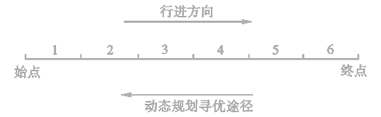

<link rel='stylesheet' href='../../style/index.css'>

# [动态规划](./index.html)

[TOC]

## 基本概念 

动态规划是解决多阶段决策过程最优化的一种数学方法。

### 马尔科夫性

如果某阶段状态给定后，则在这阶段以后过程的发展不受这阶段以前各段状态的影响。换句话说，过程的过去历史只能通过当前的状态去影响它未来的发展，当前的状态是以往历史的一个总结。这个性质称为**无后效性（即马尔科夫性）**。

### 最优性原理

无论过去的状态和决策如何，对前面的决策所形成的状态而言，余下的诸决策必须构成最优策略。即，**最优策略的子策略总是最优的**。可以利用该原理，通过局部最优来逆推全局最优。

### 动态规划和静态规划

- 线性规划和非线性规划研究的问题通常与时间无关，故又称为**静态规划**。
- 动态规划、静态规划都属于**数学规划**范围，都是在若干约束条件下的函数极值问题，都利用迭代法去逐步求解。
- **一些静态规划只要适当引入阶段变量、状态、决策等就可以转化为动态规划问题**。
- 动态规划研究的问题与时间有关，研究具有多阶段决策过程的一类问题，将问题的整体按时间或空间的特征分成若干个前后衔接的时空阶段，把多阶段决策问题表示为前后有关联的一系列单阶段决策问题，然后逐个加以解决，从而求出整个问题的最优决策序列。

| 规划类型 | 内容 | 与时间关系 | 问题类型 | 解决方案
| :-: | - | - | - | - |
| 静态规划 | 线性规划、非线性规划 | 无关 |  | 一定条件下可转换为动态规划问题
| 动态规划 | 动态规划 | 有关 | 多阶段决策 | 

## 解决动态规划的方法

| 解法 | 适用情况 |
| :-: | :- |
| 逆序解法 | 已给定初始状态
| 顺序解法 | 已给定终止状态

#### 例

$\max z = x_1 ⋅ {x_2}^2 ⋅ x_3$
$\begin{cases}
    x_1 + x_2 + x_3 = c & c>0
\\  x_i ≥ 0, & i = 1,2,3
\end{cases}$

使用**逆序法**解答上述问题。

**解**

设第$k$阶段初始状态为$s_k$，有最优值函数$f_k(s_k)$。

令$\begin{cases}
    s_3 = x_3           & ⇒\ \ \ 0 ≤ x_3 = s_3
\\  s_2 = x_2 + s_3     & ⇒\ \ \ 0 ≤ x_2 ≤ s_2
\\  s_1 = x_1 + s_2 = c & ⇒\ \ \ 0 ≤ x_1 ≤ s_1 = c
\end{cases}$

根据逆推法（最优解从后向前传递）有

- *Step1*：$f_3(s_3) = \max\limits_{x_3 = s_3} x_3$
  - 故$f_3(s_3)\Big|_{x_3 = s_3} = s_3$
- *Step2*：$f_2(s_2) = \max\limits_{0 ≤ x_2 ≤ s_2} {x_2}^2f_3(s_3) =
    \max\limits_{0 ≤ x_2 ≤ s_2} {x_2}^2(s_2-x_2)
    \xrightarrow{记作} \max\limits_{0 ≤ x_2 ≤ s_2} h_2(s_2, x_2)
$
  - $\dfrac{{\rm d}h_2}{{\rm d}x_2} = 2x_2s_2 - 3{x_2}^2 = 0 { \ \ \ ⇒ \ \ \ }$$x_2 = \dfrac{2}{3}s_2$、$x_2 = 0$（舍去）
  - $\dfrac{{\rm d^2}h_2}{{\rm d}{x_2}^2} = 2s_2 - 6x_2$
    - $\dfrac{{\rm d^2}h_2}{{\rm d}{x_2}^2}\Big|_{x_2 = \frac{2}{3}s_2} = -2s_2 < 0$，故$x_2$为极大值点
  - 故$f_2(s_2)\Big|_{x_2 = \frac{2}{3}s_2} = \dfrac{4}{27} {s_2}^3$
- *Step3*：$f_1(s_1) = \max\limits_{0 ≤ x_1 ≤ s_1} {x_1}f_2(s_2) =
    \max\limits_{0 ≤ x_1 ≤ s_1} x_1 \dfrac{4}{27} (s_1 - x_1)^3
    \xrightarrow{记作}  \max\limits_{0 ≤ x_1 ≤ s_1} h_1(s_1, x_1)
$
  - $\dfrac{{\rm d}h_1}{{\rm d}x_1} = \dfrac{4}{27}(s_1-x_1)^2(s_1-4x_1) = 0 { \ \ \ ⇒ \ \ \ }$$x_1 = \dfrac{1}{4}s_1$、$x_1=s_1$
  - $\dfrac{{\rm d^2}h_1}{{\rm d}{x_1}^2} = -\dfrac{4}{27}[2(s_1-x_1)(s_1-4x_1)+4(s_1-x_1)]$
    - $\dfrac{{\rm d^2}h_1}{{\rm d}{x_1}^2}\Big|_{x_1 = \frac{1}{4}s_1} = -\dfrac{4}{9}s_1 < 0$，故$x_1=\dfrac{1}{4}s_1$为极大值点

综上

$\begin{cases}
    x_1 = \frac{1}{4}c
\\  x_2 = \frac{2}{3}(c - x_1) = \frac{1}{2}c
\\  x_3 = s_3 = s_2 - x_2 = \frac{1}{4}c
\end{cases}$

$\max z = f_1(s_1) = \dfrac{1}{64}{s_1}^4 = \dfrac{1}{64}c^4$

## 最优路径问题

### 求解方法

如果由起点$A$经过$P$点和点$H$而到达终点G是一条**最短路线**，则由点$P$出发经过$H$点到达终点$G$的这条子路线，对于从点$P$出发到达终点的所有可能选择的不同路线来说，必定也是最短路线。

寻找最短路线的方法，就是从最后一段开始，用由后向前逐步递推的方法，求出各点到G点的最短路线，最后求得由A点到G点的最短路线。

## 资源分配问题

将数量一定的一种或若干种资源，恰当地分配给若干个使用者，且使目标函数为最优。

在应用动态规划方法处理这类静态规划问题时，通常以把资源分配给一个或几个使用者的过程作为一个阶段，把问题中的变量$x_i$视为决策变量，将累计的量或随递推过程变化的量选为状态变量。

#### 例

这五台设备如何分配给甲乙丙各工厂，才能使盈利最大。 

**解**

将分配过程分为三个阶段

1. 给甲厂分配$x_1$台
2. 给乙厂分配$x_2$台
3. 给丙厂分配$x_3$台

|| 甲 | 乙 | 丙 | &nbsp;
|:-:|:-:|:-:|:-:|:-|
| $s_1$ | √ | √ | √ | $s_1 = x_1 + x_2 + x_3 = 5$
| $s_2$ | × | √ | √ | $s_2 = s_1 - x_1 = x_2 + x_3$
| $s_3$ | × | × | √ | $s_3 = s_2 - x_2 = x_3$
| $s_4$ | × | × | × | $s_4 = s_3 - x_3 = 0$

$$\begin{cases}
    f_k(s_k) = \max\limits_{0≤x_k≤s_k} [P_x(x_k) + f_{k+1}(s_k - x_k)] & k=3,2,1
\\  f_4(s_4) = 0
\end{cases}$$

- $x_k$：分配给第$k$个工厂的设备台数
- $s_k$：分配给第$k$个至第$n$个工厂一共的设备台数
- $P_k(x_k)$：$x_k$台设备分配到第$k$个工厂所得的盈利值
- $f_k(s_k)$：$s_k$台设备分配到第$k$个至第$n$个工厂一共所得的盈利值

使用逆推法

$f_3(s_3) = \max\limits_{x_3} [P_3(x_3) + f_4(s_4)] = \max\limits_{x_3} P_3(x_3)$

因为此时只有一个工厂，有多少台设备就全部分配给工厂丙，故它的盈利值就是该段的最大盈利值。

$\begin{array}{| c | c c c c c c | c c |}
\hline
    s_3 \backslash x_3
      & 0  & 1  & 2  & 3  & 4  & 5  & f_3(s_3) & x_3^*
\\\hline
    0 & 0  &    &    &    &    &    & 0        & 0
\\  1 &    & 4  &    &    &    &    & 4        & 1
\\  2 &    &    & 6  &    &    &    & 6        & 2
\\  3 &    &    &    & 11 &    &    & 11       & 3
\\  4 &    &    &    &    & 12 &    & 12       & 4
\\  5 &    &    &    &    &    & 12 & 12       & 5
\\\hline
\end{array}$

$f_2(s_2) = \max\limits_{x_2} [P_2(x_2) + f_3(s_2 - x_2)]$

同时考虑工厂乙和工厂丙的盈利值。

$\begin{array}{| c | c c c c c c | c c |}
\hline
    s_2 \backslash x_2
      & 0    & 1    & 2     & 3    & 4    & 5    & f_2(s_2) & x_2^*
\\\hline
    0 & 0    &      &       &      &      &      & 0        & 0
\\  1 & 0+4  & 5+0  &       &      &      &      & 5        & 1
\\  2 & 0+6  & 5+4  & 10+0  &      &      &      & 10       & 2
\\  3 & 0+11 & 5+6  & 10+4  & 11+0 &      &      & 14       & 2
\\  4 & 0+12 & 5+11 & 10+6  & 11+4 & 11+0 &      & 16       & 2,3
\\  5 & 0+12 & 5+12 & 10+11 & 11+6 & 11+4 & 11+0 & 21       & 2
\\\hline
\end{array}$

$f_1(5) = \max\limits_{x_1} [P_1(x_1) + f_2(5 - x_1)]$

已知工厂乙和工厂丙的最优盈利值的情况下，再联合考虑工厂甲的盈利值。

$\begin{array}{| c | c c c c c c | c c |}
\hline
    s_1 \backslash x_1
      & 0    & 1    & 2    & 3    & 4    & 5    & f_1(s_1) & x_1^*
\\\hline
    5 & 0+21 & 3+16 & 7+14 & 9+10 & 12+5 & 13+0 & 21       & 0,2
\\\hline
\end{array}$

综上可得

$\begin{cases}
    x_1 = 2
\\  x_2 = 2
\\  x_3 = 1
\\  \max f_1(5) = 21
\end{cases}$ 或 $\begin{cases}
    x_1 = 0
\\  x_2 = 2
\\  x_3 = 3
\\  \max f_1(5) = 21
\end{cases}$
