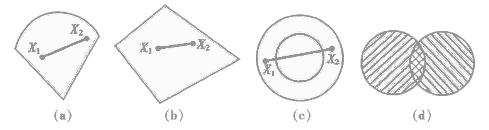
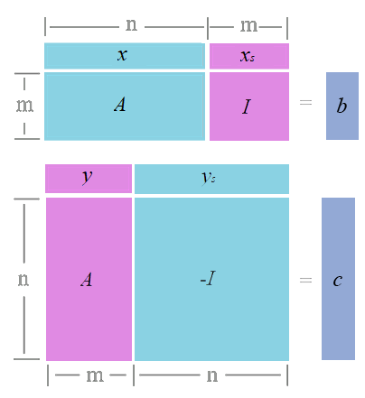

<link rel='stylesheet' href='../../style/index.css'>
<script src='../../style/index.js'></script>

# [线性规划（*Linear Programming*）](./index.html)

[TOC]

## 导论

### 基本思想

有限得资源获得最大收益。

### 不等式转等式

假设存在不等式

$$x_1 + x_2 ≤ b$$

现新增一个变量$x_3$，将不等式转化为等式

$$x_1 + x_2 + x_3 = b$$

$x_3$即称为**剩余变量**。

同理，若有$x_1 + x_2 ≥ b$，则转换为$x_1 + x_2 - x_3 = b$。此时$x_3$称为**松弛变量**。

### 表示形式

**一般形式**

$$\{\max | \min \} \,\,\, z = c_1x_1 + c_2x_2 + \cdots + c_nx_n
\newline
\begin{cases}
    a_{11}x_1 + \cdots + a_{1n}x_n \,\,\, \{ ≤ | = | ≥ \} \,\,\, b_1
\\  \cdots
\\  a_{m1}x_1 + \cdots + a_{mn}x_n \,\,\, \{ ≤ | = | ≥ \} \,\,\, b_m
\\  x_1, x_2, \cdots, x_n ≥ 0
\end{cases}
$$

- $c$：价值系数
- $a$：技术系数
- $b$：资源限制

**标准型**

$$\max \,\,\, z = c_1x_1 + c_2x_2 + \cdots + c_nx_n
\newline
\begin{cases}
    a_{11}x_1 + \cdots + a_{1n}x_n \,\,\, = \,\,\, b_1 
\\  \cdots
\\  a_{m1}x_1 + \cdots + a_{mn}x_n \,\,\, = \,\,\, b_m
\\  x_1, x_2, \cdots, x_n ≥ 0
\\  b_i ≥ 0 \,\,\, (i=1,2,\cdots,m)
\end{cases}
$$

每个约束条件都是不可缺省得，所以矩阵$A_{m×n}$应该是行满秩（$r(A)=m ≤ n$）得。

#### 例1

有一般形
$\max \,\,\, z = 2x_1 + 3x_2
\newline
\begin{cases}
    x_1 + 2x_2 ≤ 80
\\  4x_1 ≤ 160
\\  4x_2 ≤ 120
\\  x_1, x_2 ≥ 0
\end{cases}
$

转化为标准型得

$\max \,\,\, z = 2x_1 + 3x_2 + 0x_3 + 0x_4 + 0x_5$
$
\begin{cases}
    x_1 + 2x_2 + x_3 = 80
\\  4x_1 + x_4 = 160
\\  4x_2 + x_5 = 120
\\  x_1, x_2, x_3, x_4, x_5 ≥ 0
\end{cases}
$

### 解的概念

- **可行解**：满足约束条件的解。
- **可行域**：所有可行解的集合。
- **最优解**：使目标函数达到最大的可行解。
- **基**：$B_{m×m}$是约束方程$A_{m×n}$的非奇异子矩阵，称$B$是线性规划的一个基，最多有$C_n^m$个基。

**基解**

$Ax=b$
$\,\,\, ⇒ \,\,\,
\left[\begin{array}{c}
    B & N
\end{array}\right]
\left[\begin{array}{c}
    x_B
\\  x_N
\end{array}\right]
=b
$
$\,\,\, ⇒ \,\,\, Bx_B + Nx_N = b$
$\,\,\, ⇒ \,\,\, x_B = B^{-1}b - B^{-1}Nx_N$

$x_B$即为**基解**。

**基可行解**


满足非负约束条件的基解，称为**基可行解**。

### 凸集



从直观上将，凸集没有凹入部分，其内部没有空洞。

(a)、(b)是凸集，(c)不是凸集，任何两个凸集的交集是凸集(d)。

## 图解法

只适合两个变量

## 单纯形法

>**单纯形**：指0维中的点，1维中的线段，2维中的三角形，3维中的四面体，$n$维空间中的有$n+1$个顶点的多面体。

### 基本思路

从线性规划问题的一个基本可行解开始，转换到另一个使目标函数值增大的基本可行解。反复迭代，直到目标函数值达到最大时，就得到了最优解。

```flow
st=>start: 确定初始可行解
cond=>condition: 最优解？
op1=>operation: 基变换、迭代
op2=>operation: 求最优目标函数
ed=>end: 结束

st->cond
cond(yes)[sd]->op2->ed
cond(no)->op1->cond
```

### 单纯形表


- $n$：有效变量个数
- $m$：基变量个数
- $C_B$：基变量系数（初始为$0$）
- $X_B$：基变量
- $σ_j$：检验系数

$$σ_j = c_j - \sum\limits_{i=1}^{m} c_{n+i} ⋅ a_{ij}$$

#### 例1：续


- *Step1*：选取进基、离基、主元
  - 选出$σ$最大的**列**$j$作为**进基**。
  - 从**进基**中选出$\dfrac{b_i}{x_{ij}}$（$x_{ij}$为0则视为无穷大）最小的**行**$i$为**离基**。
  - **进基**、**离基**的交叉点为**主元**$a_{ij}$。
- *Step2*：元素退场
  - **离基**同时除以**主元**
  - **离基**$x_B$更换为**进基**变量
  - **离基**$C_B$更换为$σ_j$
- *Step3*：除**主元**外**进基**其它元素用**离基**消为0。
- *Step4*：重新计算$σ$。
- *Step5*：重复上述操作直到$σ_j≤0, \,\,\, j=1,2,\cdots,n+m$。

### 人工变量法

针对$Ax ≥ b$的问题

**大M法**

在目标函数里给人工变量赋一个充分大的费用系数——$M$。由于人工变量为基变量，对目标函数来讲是不经济的，所以应尽快地用非人工变量把人工变量从基中替换出来。手算时这个充分大的费用系数无须赋予一个特定的值，在求解最大化问题时，用字母$M$来表示这一费用系数，而在最小化问题中，用$M$来表示收益系数。在此$M$是一个充分大的正数。

**两阶段法**

手工计算**大M法**不会出现任何问题，但对于计算机来说，$M$可能带来相当的麻烦，为避免$M$可能带来的麻烦，便出现了两阶段法。两阶段法就是把LP问题的求解分为两个阶段来进行。

第一阶段：在原约束条件下，先求解一个目标函数只包含人工变量的人造LP问题，即令极小值目标函数中人工变量的系数取某个正的常数（通常为1），而其他变量的系数为0。显然，如果第一阶段对人造问题优化的最小目标函数值是“0”，说明所有的人工变量都已不在基中，得到了原始问题的一个基可行解，求解转入第二阶段，反之，如果第一阶段优化的结果大于“0”，那么至少有一个人工变量仍留在基中，意味着原问题无可行解。

第二阶段：从第一阶段得到的基可行解出发，求原问题的最优解。具体过程是在第一阶段的最终单纯形表中，去掉人工变量所在的列并将价值系数换为原问题的价值系数，以便构成第二阶段的初始单纯形表。

## 对偶理论

### 标准型对偶问题关系

**原问题**

$\max \,\,\, z = c^Tx$
$
\begin{cases}
    Ax ≤ b
\\  x ≥ 0
\end{cases}
$

**对偶问题**

$\min \,\,\, ω = b^Ty$
$
\begin{cases}
    A^Ty ≥ c
\\  y ≥ 0
\end{cases}
$

### 非标准型对偶变换

#### 例2

已知
$\max \,\,\, z = 4x_1 + 5x_2$
$
\begin{cases}
    3x_1 + 2x_2 ≤ 20
\\  4x_1 - 3x_2 ≥ 10
\\  x_1 + x_2 = 5
\\  x_1≥0, x_2±
\end{cases}
$

求其非标准型的对偶变换

- $x=
\left[\begin{array}{c}
    x_1 & x_2
\end{array}\right]^T
$
- $y=
\left[\begin{array}{c}
    y_1 & y_2 & y_3
\end{array}\right]^T
$
- $c=
\left[\begin{array}{c}
    4 & 5
\end{array}\right]^T
$
- $b=
\left[\begin{array}{c}
    20 & 10 & 5
\end{array}\right]^T
$
- $A=
\left[\begin{array}{c}
    3 & 2
\\  4 & -3
\\  1 & 1
\end{array}\right]
$

**解**

- *Step1*：$\min \,\,\, ω = 20y_1 + 10y_2 + 5y_3$
- *Step2*：$A^Ty$与$c$的关系
  - $x_1≥0 \,\,⇒\,\, ≥ 4$
  - $x_2±  \,\,⇒\,\, = 5$
- *Step3*：$y$的约束
  - $≤ 20 \,\,⇒\,\, y_1≥0$
  - $≥ 10 \,\,⇒\,\, y_2≤0$
  - $= 5  \,\,⇒\,\, y_3±$

**综上**

$\min \,\,\, ω = 20y_1 + 10y_2 + 5y_3$
$
\begin{cases}
    3y_1 + 4y_2 + y_3 ≥ 4
\\  2y_1 - 3y_2 + y_3 = 5
\\  y_1≥0,  y_2≤0, y_3±
\end{cases}
$

### 对偶理论

**弱对偶性**

若$\bar{x}$、$\bar{y}$分别是原问题和对偶问题的可行解，则存在$c^T\bar{x}≤b^T\bar{y}$。

**无界性**

- 如果原（对偶）问题为**无界解**，则其对偶（原）问题**无可行解**。
- 当原（对偶）问题为**无可行解**，其对偶（原）问题具有**无界解或无可行解**。

**强对偶性**

若$\hat{x}$、$\hat{y}$分别是原问题和对偶问题的可行解，当$c^T\hat{x}=b^T\hat{y}$时$\hat{x}$、$\hat{y}$分别是对应问题的最优解。

**对偶定理**

若原问题和对偶问题两者皆可行，则两者均有最优解，且此时目标函数值相等。

对偶问题的解必然是下列三种情况之一：

- 原问题和对偶问题都有最优解。
- 一个问题具有无界解，另一个问题无可行解。
- 原问题和对偶问题都无可行解。

### 互补松弛定理

设$\hat{x}$、$\hat{y}$分别是原问题和对偶问题的可行解，$x_s$为原问题的松弛变量的值，$y_s$为对偶问题剩余变量的值。 

$
\begin{cases}
    A\hat{x} + x_s = b    & \hat{x}, x_s ≥ 0
\\  A^T\hat{y} - y_s = c  & \hat{y}, y_s ≥ 0
\end{cases}
$

- $
\begin{cases}
    A\hat{x} + x_s = b
\\  \hat{y}^TA - y_s^T = c^T
\end{cases}
$
- $
\begin{cases}
    \hat{y}^TA\hat{x} + \hat{y}^Tx_s = \hat{y}^Tb
\\  \hat{y}^TA\hat{x} - y_s^T\hat{x} = c^T\hat{x}
\end{cases}
$
- $\hat{y}^Tx_s + y_s^T\hat{x} =  \hat{y}^Tb - c^T\hat{x}$
- 若$\hat{y}^Tx_s + y_s^T\hat{x} = 0$，则$\hat{y}^Tb - c^T\hat{x} = 0$，即$(\hat{y},b) = (c,\hat{x})$。





$x^*$、$y^*$分别是原问题和对偶问题最优解的**充要条件**是$(y^*,x_s) + (y_s,x^*) = 0$，或

$$(y^*,x_s) = 0, (y_s,x^*) = 0$$

即，原问题的解及其对偶模型的松弛变量（剩余变量），必有一个为0。

#### 例3

**原问题**

$\min \,\,\, ω = 2x_1 + 3x_2 + 5x_3 + 2x_4 + 3x_5$
$
\begin{cases}
    x_1 + x_2 + 2x_3 + x_4 + 3x_5 ≥ 4
\\  2x_1 - x_2 + 3x_3 + x_4 + x_5 ≥ 3
\\  x_i≥0, i=1,2,3,4,5
\end{cases}
$

已知其对偶问题的最优解为

$
\begin{cases}
    y_1^* = \frac{4}{5}
\\  y_2^* = \frac{3}{5}
\\  z = 5
\end{cases}
$

试找出原问题最优解。

**解**

对偶问题为

$\max \,\,\, z = 4y_1 + 3y_2$
$
\begin{cases}
    y_1 + 2y_2 ≤ 2
\\  y_1 - y_2 ≤ 3
\\  2y_1 + 3y_2 ≤ 5
\\  y_1 + y_2 ≤ 2
\\  3y_1 + y_2 ≤ 3
\\  y_1, y_2 ≥ 0
\end{cases}
$

带入$y_1^*$、$y_2^*$。

$
\begin{cases}
    ①: (y_1 + 2y_2 = 2) + y_{s1}= 2
\\  ②: (y_1 - y_2 = \frac{1}{5}) + y_{s2} = 3
\\  ③: (2y_1 + 3y_2 = \frac{17}{5}) + y_{s3} = 5
\\  ④: (y_1 + y_2 = \frac{7}{5}) + y_{s4} = 2
\\  ⑤: (3y_1 + y_2 = 3) + y_{s5} = 3
\end{cases}
$

- $y_{s1} = y_{s5} = 0$
- $y_{s2}≠0, y_{s3}≠0, y_{s4}≠0$

由**互补松弛性**（$y_{si} ⋅ x_{i}^* = 0$）得

$$x_2^* = x_3^* = x_4^* = 0$$

又因为$y_1, y_2 ≥ 0$，由**互补松弛性**（$y_i^* ⋅ x_{si} = 0$）得

$$x_{s1} = x_{s2} = 0$$

综上得

$
\begin{cases}
    x_1^* + 0 + 0 + 0 + 3x_5^* + 0 = 4
\\  2x_1^* - 0 + 0 + 0 + x_5^* + 0 = 3
\\  x_i≥0, i=1,2,3,4,5
\end{cases}
$

计算得

$$x_1^* = 1, x_5^* =1, ω^* = 5$$

## 对偶单纯形

先选**离基**，再选**进基**。

## 灵敏度分析

