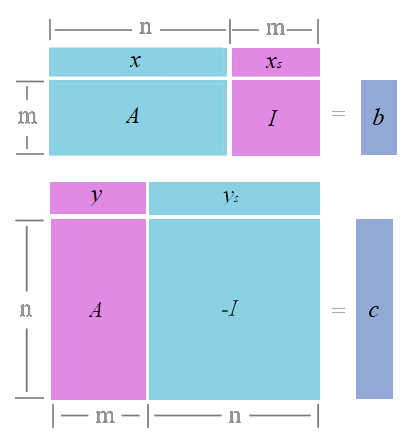

<link rel='stylesheet' href='../../../style/index.css'>

# [线性规划（*Linear Programming*）：对偶理论](../index.html)

[TOC]

## 对偶问题关系

### 标准型

**原问题**

$\max \,\,\, z = c^Tx$
$
\begin{cases}
    Ax ≤ b
\\  x ≥ 0
\end{cases}
$

**对偶问题**

$\min \,\,\, ω = b^Ty$
$
\begin{cases}
    A^Ty ≥ c
\\  y ≥ 0
\end{cases}
$

### 非标准型

$
\begin{array}{r c l}
\hline
    原问题 & → & 对偶问题
\\  \hline
\\  x ≥ 0  & → & A^Ty ≥ c
\\  x ≤ 0  & → & A^Ty ≤ c
\\  x±     & → & A^Ty = c
\\  \hline
\\  Ax ≤ b & → & y≥0
\\  Ax ≥ b & → & y≤0
\\  Ax = b & → & y±
\\  \hline
\end{array}
$

#### 例

已知
$\max \,\,\, z = 4x_1 + 5x_2$
$
\begin{cases}
    3x_1 + 2x_2 ≤ 20
\\  4x_1 - 3x_2 ≥ 10
\\  x_1 + x_2 = 5
\\  x_1≥0, x_2±
\end{cases}
$

求其非标准型的对偶变换

- $x=
\left[\begin{array}{c}
    x_1 & x_2
\end{array}\right]^T
$
- $y=
\left[\begin{array}{c}
    y_1 & y_2 & y_3
\end{array}\right]^T
$
- $c=
\left[\begin{array}{c}
    4 & 5
\end{array}\right]^T
$
- $b=
\left[\begin{array}{c}
    20 & 10 & 5
\end{array}\right]^T
$
- $A=
\left[\begin{array}{c}
    3 & 2
\\  4 & -3
\\  1 & 1
\end{array}\right]
$

**解**

- *Step1*：$\min \,\,\, ω = 20y_1 + 10y_2 + 5y_3$
- *Step2*：$A^Ty$与$c$的关系
  - $x_1≥0 \,\,⇒\,\, ≥ 4$
  - $x_2±  \,\,⇒\,\, = 5$
- *Step3*：$y$的约束
  - $≤ 20 \,\,⇒\,\, y_1≥0$
  - $≥ 10 \,\,⇒\,\, y_2≤0$
  - $= 5  \,\,⇒\,\, y_3±$

**综上**

$\min \,\,\, ω = 20y_1 + 10y_2 + 5y_3$
$
\begin{cases}
    3y_1 + 4y_2 + y_3 ≥ 4
\\  2y_1 - 3y_2 + y_3 = 5
\\  y_1≥0,  y_2≤0, y_3±
\end{cases}
$

## 对偶性质

### 一般性质

**弱对偶性**

若$\bar{x}$、$\bar{y}$分别是原问题和对偶问题的可行解，则存在$c^T\bar{x}≤b^T\bar{y}$。

**无界性**

- 如果原（对偶）问题为**无界解**，则其对偶（原）问题**无可行解**。
- 当原（对偶）问题为**无可行解**，其对偶（原）问题具有**无界解或无可行解**。

**强对偶性**

若$\hat{x}$、$\hat{y}$分别是原问题和对偶问题的可行解，当$c^T\hat{x}=b^T\hat{y}$时$\hat{x}$、$\hat{y}$分别是对应问题的最优解。

**对偶定理**

若原问题和对偶问题两者皆可行，则两者均有最优解，且此时目标函数值相等。

对偶问题的解必然是下列三种情况之一：

- 原问题和对偶问题都有最优解。
- 一个问题具有无界解，另一个问题无可行解。
- 原问题和对偶问题都无可行解。

<!-- **小结**

| 原问题 | 对偶问题 | 目标函数 |
|:-:|:-:|:-:|
| 基可行解 | 非可行解 | $c^Tx ≤ b^Ty$
| 基可行解 | 基可行解 | $c^Tx = b^Ty$
| 无界解 | 无可行解 | -->

### 互补松弛定理

设$\hat{x}$、$\hat{y}$分别是原问题和对偶问题的可行解，$x_s$为原问题的松弛变量的值，$y_s$为对偶问题剩余变量的值。

$
\begin{cases}
    A\hat{x} + x_s = b    & \hat{x}, x_s ≥ 0
\\  A^T\hat{y} - y_s = c  & \hat{y}, y_s ≥ 0
\end{cases}
$

- $
\begin{cases}
    A\hat{x} + x_s = b
\\  \hat{y}^TA - y_s^T = c^T
\end{cases}
$
- $
\begin{cases}
    \hat{y}^TA\hat{x} + \hat{y}^Tx_s = \hat{y}^Tb
\\  \hat{y}^TA\hat{x} - y_s^T\hat{x} = c^T\hat{x}
\end{cases}
$
- $\hat{y}^Tx_s + y_s^T\hat{x} =  \hat{y}^Tb - c^T\hat{x}$
- 若$\hat{y}^Tx_s + y_s^T\hat{x} = 0$，则$\hat{y}^Tb - c^T\hat{x} = 0$，即$(\hat{y},b) = (c,\hat{x})$。

$x^*$、$y^*$分别是原问题和对偶问题最优解的**充要条件**是$(y^*,x_s) + (y_s,x^*) = 0$，或

$$(y^*,x_s) = 0, (y_s,x^*) = 0$$

即，原问题的解及其对偶模型的松弛变量（剩余变量），必有一个为0。

#### 例

**原问题**

$\min \,\,\, ω = 2x_1 + 3x_2 + 5x_3 + 2x_4 + 3x_5$
$
\begin{cases}
    x_1 + x_2 + 2x_3 + x_4 + 3x_5 ≥ 4
\\  2x_1 - x_2 + 3x_3 + x_4 + x_5 ≥ 3
\\  x_j≥0, j=1,2,3,4,5
\end{cases}
$

已知其对偶问题的最优解为

$
\begin{cases}
    y_1^* = \frac{4}{5}
\\  y_2^* = \frac{3}{5}
\\  z = 5
\end{cases}
$

试找出原问题最优解。

**解**

对偶问题为

$\max \,\,\, z = 4y_1 + 3y_2$
$
\begin{cases}
    y_1 + 2y_2 ≤ 2
\\  y_1 - y_2 ≤ 3
\\  2y_1 + 3y_2 ≤ 5
\\  y_1 + y_2 ≤ 2
\\  3y_1 + y_2 ≤ 3
\\  y_1, y_2 ≥ 0
\end{cases}
$

带入$y_1^*$、$y_2^*$。

$
\begin{cases}
    ①: (y_1 + 2y_2 = 2) + y_{s1}= 2
\\  ②: (y_1 - y_2 = \frac{1}{5}) + y_{s2} = 3
\\  ③: (2y_1 + 3y_2 = \frac{17}{5}) + y_{s3} = 5
\\  ④: (y_1 + y_2 = \frac{7}{5}) + y_{s4} = 2
\\  ⑤: (3y_1 + y_2 = 3) + y_{s5} = 3
\end{cases}
$

- $y_{s1} = y_{s5} = 0$
- $y_{s2}≠0, y_{s3}≠0, y_{s4}≠0$

由**互补松弛性**（$y_{si} ⋅ x_{i}^* = 0$）得

$$x_2^* = x_3^* = x_4^* = 0$$

又因为$y_1, y_2 ≥ 0$，由**互补松弛性**（$y_i^* ⋅ x_{si} = 0$）得

$$x_{s1} = x_{s2} = 0$$

综上得

$
\begin{cases}
    x_1^* + 0 + 0 + 0 + 3x_5^* + 0 = 4
\\  2x_1^* - 0 + 0 + 0 + x_5^* + 0 = 3
\\  x_j≥0, j=1,2,3,4,5
\end{cases}
$

计算得

$$x_1^* = 1, x_5^* =1, ω^* = 5$$

## 对偶单纯形法

### 解法

- *Step1*：选
  - 选出$b$最小的行$i$作为**离基**。
  - 在行$i$中选出$\left|\dfrac{σ_j}{a_{ij}}\right|$（$a_{ij}<0$）最小的列$j$为**进基**。
  - $i$、$j$的交叉点为**主元**$a_{ij}$。
- *Step2*：消
  - $\dfrac{row(i)}{a_{ij}}$
  - $\underset{k\ in\ row,k≠i}{for} [row(k) - a_{kj}row(i)]$
- *Step3*：换
  - 行$i$，$x_B$更换为**进基**变量
  - 行$i$，$C_B$更换为$σ_j$
- *Step4*：重新计算$σ$。
- *Step5*：重复上述操作直到$σ_j≥0$。

#### 例

$\min \,\,\, ω = x_1 + 4x_2 + 3x_4$
$
\begin{cases}
    x_1 + 2x_2 - x_3 + x_4 ≥ 3
\\  -2x_1 - x_2 + 4x_3 + x_4 ≥ 2
\\  x_j≥0, j=1,2,3,4
\end{cases}
$

**引入松弛变量，转化为标准型**

$\min \,\,\, ω = x_1 + 4x_2 + 3x_4$
$
\begin{cases}
    -x_1 - 2x_2 + x_3 - x_4 + x_5 = -3
\\  2x_1 + x_2 - 4x_3 - x_4 + x_6 = -2
\\  x_j≥0, j=1,2,3,4,5,6
\end{cases}
$

**解**

|   |   |   |   |   |   |   |   |   |
|:-:|:-:|:-:|:-:|:-:|:-:|:-:|:-:|:-:|
|       | $c_j$ | 1      | 4     | 0     | 3     | 0     | 0     |
| $C_B$ | $X_B$ | $x_1$  | $x_2$ | $x_3$ | $x_4$ | $x_5$ | $x_6$ | $b$
| 0     | $x_5$ | **-1** | -2    | 1     | -1    | 1     | 0     | -3
| 0     | $x_6$ | 2      | 1     | -4    | -1    | 0     | 1     | -2
|       | $σ_j$ | 1      | 4     | 0     | 3     | 0     | 0     |
| &nbsp;
| $C_B$ | $X_B$ | $x_1$ | $x_2$ | $x_3$  | $x_4$ | $x_5$ | $x_6$ | $b$
| 1     | $x_1$ | 1     | 2     | -1     | 1     | -1    | 0     | 3
| 0     | $x_6$ | 0     | -3    | **-2** | -3    | 2     | 1     | -8
|       | $σ_j$ | 0     | 2     | 1      | 2     | 1     | 0     |
| &nbsp;
| $C_B$ | $X_B$ | $x_1$ | $x_2$         | $x_3$ | $x_4$         | $x_5$ | $x_6$          | $b$
| 1     | $x_1$ | 1     | $\frac{7}{2}$ | 0     | $\frac{5}{2}$ | -2    | $-\frac{1}{2}$ | 7
| 0     | $x_3$ | 0     | $\frac{3}{2}$ | 1     | $\frac{3}{2}$ | -1    | $-\frac{1}{2}$ | 4
|       | $σ_j$ | 0     | $\frac{1}{2}$ | 0     | $\frac{1}{2}$ | 2     | $\frac{1}{2}$  |

最优解时$x_1=7$、$x_3=4$

$$ω = x_1 + 4x_2 + 3x_4 = 7$$
