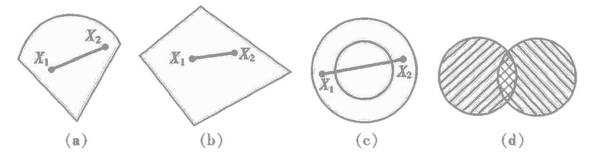

<link rel='stylesheet' href='../../../style/index.css'>
<script src='../../../style/index.js'></script>

# [线性规划（*Linear Programming*）：导论](../index.html)

[TOC]

## 基本思想

有限得资源获得最大收益。

## 不等式转等式

### 剩余变量

假设存在不等式

$$x_1 + x_2 ≤ b$$

现新增一个变量$x_3$，将不等式转化为等式

$$x_1 + x_2 + x_3 = b$$

$x_3$即称为**剩余变量**。

### 松弛变量

同理，若有

$$x_1 + x_2 ≥ b$$

则转换为

$$x_1 + x_2 - x_3 = b$$

此时$x_3$称为**松弛变量**。

## 表示形式

### 一般形式

$\{\max | \min \} \,\,\, z = c_1x_1 + c_2x_2 + \cdots + c_nx_n$
$
\begin{cases}
    a_{11}x_1 + \cdots + a_{1n}x_n \,\,\, \{ ≤ | = | ≥ \} \,\,\, b_1
\\  \cdots
\\  a_{m1}x_1 + \cdots + a_{mn}x_n \,\,\, \{ ≤ | = | ≥ \} \,\,\, b_m
\\  x_1, x_2, \cdots, x_n ≥ 0
\end{cases}
$

### 标准型

$\max \,\,\, z = c^Tx$
$
\begin{cases}
    Ax = b
\\  x_j ≥ 0
\end{cases}
$

- $c$：**价值向量**
- $a$：**技术矩阵**
- $b$：**资源向量**
- $x$：**决策向量**

每个约束条件都不可缺省，所以矩阵$A_{m×n}$应该是行满秩矩阵，即$r(A)=m ≤ n$。

### *Example*

#### 例

有一般形

$\max \,\,\, z = 2x_1 + 3x_2$
$
\begin{cases}
    x_1 + 2x_2 ≤ 80
\\  4x_1 ≤ 160
\\  4x_2 ≤ 120
\\  x_1, x_2 ≥ 0
\end{cases}
$

转化为标准型得

$\max \,\,\, z = 2x_1 + 3x_2 + 0x_3 + 0x_4 + 0x_5$
$
\begin{cases}
    x_1 + 2x_2 + x_3 = 80
\\  4x_1 + x_4 = 160
\\  4x_2 + x_5 = 120
\\  x_1, x_2, x_3, x_4, x_5 ≥ 0
\end{cases}
$

## 解的概念

- **可行解**：满足约束条件（$Ax = b$、$x_j ≥ 0$）的解。
- **可行域**：所有可行解的集合。
- **最优解**：使目标函数达到最大值的可行解。

### 基

$B_{m×m}$是约束方程$A_{m×n}$的非奇异子矩阵（即$r(B)=m$、$|B|≠0$），称$B$是线性规划的一个基，最多有$C_n^m$个基。

**基解**

$Ax=b$
$\,\,\, ⇒ \,\,\,
\left[\begin{array}{c}
    B & N
\end{array}\right]
\left[\begin{array}{c}
    x_B
\\  x_N
\end{array}\right]
=b
$
$\,\,\, ⇒ \,\,\, Bx_B + Nx_N = b$
$\,\,\, ⇒ \,\,\, x_B = B^{-1}b - B^{-1}Nx_N$

$x_B$即为**基解**。

**基可行解**


满足非负约束条件（$x_j ≥ 0$）的基解，称为**基可行解**，此时的基称为**可行基**。

### 解的状况

```flow
st=>start: 线性规划问题
sub1=>condition: 是否有可行解
op1=>operation: 无可行解
sub2=>condition: 是否有最优解
op2=>operation: 无最优解
sub3=>condition: 唯一最优解
op31=>operation: 唯一解
op32=>operation: 无穷解
ed=>end: 结束

st->sub1
sub1(no)->op1->ed
sub1(yes)->sub2
sub2(no)->op2->ed
sub2(yes)->sub3
sub3(no)->op32->ed
sub3(yes)->op31->ed
```

## 几何意义

线性规划问题的可行域是一个凸集。

### 凸集



从直观上将，凸集没有凹入部分，其内部没有空洞。

(a)、(b)是凸集，(c)不是凸集，任何两个凸集的交集是凸集(d)。
