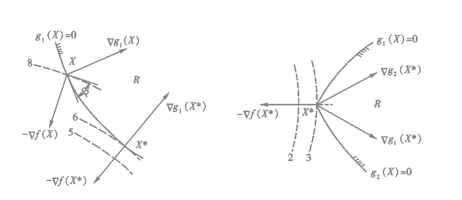

<link rel='stylesheet' href='../../../style/index.css'>

# [非线性规划：约束极值问题](../index.html)

[TOC]

>大多数极值问题其变量的取值都会受到一定限制，这种限制由约束条件（$h_i$、$g_j$）来体现。
>$$
    \begin{cases}
        \min f(x)
    \\  h_i(x) = 0, i=1,2,\cdots,m
    \\  g_j(x) ≥ 0, j=1,2,\cdots,l
    \end{cases}
>$$ 或 $$
    \begin{cases}
        \min f(x) & x∈R⊂E^n
    \\  R = \{ x | g_j(x) ≥ 0, j=1,2,\cdots,l \}
    \end{cases}
>$$

## 最优性条件

### 可行下降方向

如果方向$D$既是$x^{(0)}$点的**可行方向**（约束范围内的方向），又是这个点的**下降方向**（和梯度方向成钝角的方向），就称它是该点的**可行下降方向**。该点存在可行下降方向与该点为极小点为互逆事件。

### 问题分类

假定$x^*$是非线性规划的极小点，则有以下两种情况：

- 极小点位于可行域的内部，即为**无约束问题**，$x^*$必满足$f(x^*) = 0$
- 极小点位于可行域的边界上，即为**约束问题**

### K-T条件

>库恩－塔克（Kuhn－Tucker）条件是确定某点为最优点的**必要条件**。

设$x^*$位于第一个约束条件形成的可行域边界上，即$g_1(x^*)=0$，若$x^*$是极小点，则$▽g_1(x^*)$与$▽f(x^*)$在一条直线上且方向相反。

$$▽f(x^*) - γ_1▽g_1(x^*) = 0$$

若$x^*$有两个起作用的约束$g_1(x^*)=0$、$g_2(x^*)=0$，则$▽f(x^*)$必处于$▽g_1(x^*)$与$▽g_2(x^*)$的夹角之内。

$$▽f(x^*) - γ_1▽g_1(x^*) - γ_2▽g_2(x^*) = 0$$

以此类推得

$$
    \begin{cases}
        ▽f(x^*) - \sum\limits_{j=1}^{l} γ_j^* ▽g_j(x^*) = 0
    \\  γ_j^*g_j(x^*) = 0 & j=1,2,\cdots,l
    \\  γ_j^* ≥ 0 & j=1,2,\cdots,l
    \end{cases}
$$

满足该条件的点，称为**库恩-塔克（K-T）点**。

#### 例

用K-T条件解非线性规划$
    \begin{cases}
        \min f(x) = (x-3)^2
    \\  0≤x≤5
    \end{cases}
$

**解**

改写为$
    \begin{cases}
        \min f(x) = (x-3)^2
    \\  g_1(x)=x≥0
    \\  g_2(x)=5-x≥0
    \end{cases}
$

计算出梯度$
    \begin{cases}
        ▽f(x)=2(x-3)
    \\  ▽g_1(x)=1
    \\  ▽g_2(x)=-1
    \end{cases}
$

设K-T点为$x^*$，该问题的K-T条件为$
    \begin{cases}
        2(x^*-3) - γ_1^* - (-γ_2^*) = 0
    \\  γ_1^*x^* = 0
    \\  γ_2^*(5-x^*) = 0
    \\  γ_1^*,γ_2^* ≥ 0
    \end{cases}
$

讨论

1. $γ_1^*≠0$、$γ_2^*≠0$：$x^*=0$与$x^*=5$矛盾，无解
2. $γ_1^*≠0$、$γ_2^*=0$：得$x^*=0,γ_1^*=-6<0$，不是K-T点
3. $γ_1^*=0$、$γ_2^*≠0$：得$x^*=5,γ_1^*=-4<0$，不是K-T点
4. $γ_1^*=0$、$γ_2^*=0$：得$x^*=3$，是K-T点

综上$x^*=3$就是其全局极小点。

## 制约函数法

### 外点法（惩罚函数）

构造函数$ψ(t) = \begin{cases}
    0 & t>0
\\  ∞ & t<0
\end{cases}$，显然有$ψ[g_j(x)] = \begin{cases}
    0 & x∈R
\\  ∞ & x∉R
\end{cases}$

再构造函数

$$φ(x) = f(x) + \sum\limits_{j=1}^{l} ψ[g_j(x)]$$

这样一来，就把有约束问题的求解化成了求解无约束问题

$$\min \ φ(x)$$

上述$ψ(t)$在$t=0$处不连续，没有导数。

故重新构造$ψ(t) = \begin{cases}
    0   & t≥0
\\  t^2 & t<0
\end{cases}$，则有$\sum\limits_{j=1}^{l} ψ[g_j(x)] \begin{cases}
    =0       & x∈R
\\  ∈(0, ∞) & x∉R
\end{cases}$

取$M>0$（$M$充分大），重新构造$φ(x)$为$P(x,M) = f(x) + M\sum\limits_{j=1}^{l} ψ[g_j(x)]$，即

$$P(x,M) = f(x) + M\sum\limits_{j=1}^{l} [ \min (0,g_j(x)) ]^2$$

$\min P(x, M)$的解$x(M)$即为原问题的极小解或近似极小解。函数$P(x, M)$称为**惩罚函数**，$M\sum\limits_{j=1}^{l} ψ[g_j(x)]$称为**惩罚项**，$M$称为**惩罚因子**。

随着$M$得增加惩罚函数中的惩罚项所起的作用随之增大。

#### 例

$
    \begin{cases}
        \min f(x) = x_1 + x_2
    \\  g_1(x) = -x_1^2 + x_2 ≥ 0
    \\  g_2(x) = x_1 ≥ 0
    \end{cases}
$

**解**

从$
    \begin{cases}
        -x_1^2 + x_2 < 0
    \\  x_1 < 0
    \end{cases}
$构造，从外侧趋近，即外点法。

构造$P(x,M) = (x_1 + x_2) + M\left\{ 
    [ \min (0, (-x_1^2 + x_2)) ]^2 +
    [ \min (0, x_1) ]^2
\right\}$

- $\dfrac{∂P}{∂x_1} = 1 + 2M\left\{
    (-x_1^2 + x_2)(-2x_1) +
    x_1
\right\}$
- $\dfrac{∂P}{∂x_2} = 1 + 2M\left\{ 
    (-x_1^2 + x_2)
\right\}$

令$\begin{cases}
    \dfrac{∂P}{∂x_1} = 0
\\
\\  \dfrac{∂P}{∂x_2} = 0
\end{cases}$，得$\begin{cases}
    x_1 = \dfrac{-1}{2(1+M)}
\\
\\  x_2 = \dfrac{1}{4(1+M)^2} - \dfrac{1}{2M}
\end{cases}$，即有$\min P(x, M)$的解

$$x(M) = \left[\begin{matrix}
        \dfrac{-1}{2(1+M)}
    \\  \dfrac{1}{4(1+M)^2} - \dfrac{1}{2M}
\end{matrix}\right]$$

$
    M = \begin{cases}
        1 ⇒ x=\left[ {-\dfrac{1}{4}, -\dfrac{7}{16}} \right]^T
    \\  2 ⇒ x=\left[ {-\dfrac{1}{6}, -\dfrac{2}{9}} \right]^T
    \\  3 ⇒ x=\left[ {-\dfrac{1}{8}, -\dfrac{29}{192}} \right]^T
    \\  4 ⇒ x=\left[ {-\dfrac{1}{10}, -\dfrac{23}{200}} \right]^T
    \end{cases}
$

综上，当$M→∞$时，$x(M)→[0, 0]^T$，即$x_{min}=[0, 0]^T$。

### 内点法（障碍函数）

如果要求每次迭代得到的近似解都在可行域内，以便观察目标函数值的变化情况；或者，如果$f(x)$在可行域外的性质比较复杂，甚至没有定义，这时就无法使用外点法。

当越接近边界时，惩罚越大。

$$\begin{matrix}
        \bar{P}(x, r_k) = f(x) + r_k\sum\limits_{j=1}^{l} \dfrac{1}{g_j(x)}
    &   r_k>0
\end{matrix}$$

或

$$\begin{matrix}
        \bar{P}(x, r_k) = f(x) - r_k\sum\limits_{j=1}^{l} \log[g_j(x)]
    &   r_k>0
\end{matrix}$$

$r_k\sum\limits_{j=1}^{l} \dfrac{1}{g_j(x)}$ 或 $-r_k\sum\limits_{j=1}^{l} \log[g_j(x)]$称为**障碍项**。

#### 例

$
    \begin{cases}
        \min f(x) = \dfrac{1}{3}(x_1+1)^3 + x_2
    \\  g_1(x) = x_1 - 1 ≥ 0
    \\  g_2(x) = x_2 ≥ 0
    \end{cases}
$

构造障碍函数$\bar{P}(x, r) = 
    \dfrac{1}{3}(x_1+1)^3 + x_2 +
    \dfrac{r}{x_1-1} + 
    \dfrac{r}{x_2}
$

- $\dfrac{∂\bar{P}}{∂x_1} = (x_1+1)^2 - \dfrac{r}{ (x_1-1)^2 }$
- $\dfrac{∂\bar{P}}{∂x_2} = 1 - \dfrac{r}{ {x_2}^2 }$

令$\begin{cases}
    \dfrac{∂P}{∂x_1} = 0
\\
\\  \dfrac{∂P}{∂x_2} = 0
\end{cases}$，得$\begin{cases}
    x_1(r) = \sqrt{1 + \sqrt{r}}
\\
\\   x_2(r) = \sqrt{r}
\end{cases}$

综上$x_{min} = \lim\limits_{r→0} \left[\begin{matrix}
    \sqrt{1 + \sqrt{r}} \\ \sqrt{r}
\end{matrix}\right] = [1, 0]^T$
