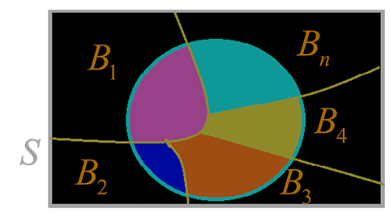

<link rel='stylesheet' href='../../style/index.css'>

# [概率论：全概率](./index.html)

## 条件概率

### 联合概率

$A$和$B$两个事件共同发生的概率

$$P(AB) = P(BA)$$

### 条件概率

$B$在$A$发生的条件下发生的概率

$$P(B|A)=\dfrac{P(AB)}{P(A)}$$

$A$在$B$发生的条件下发生的概率

$$P(A|B)=\dfrac{P(AB)}{P(B)}$$

### 乘法公式

$$P(AB) = P(B|A) ⋅ P(A)$$

$$P(AB) = P(A|B) ⋅ P(B)$$

## 全概率公式

$$P(A) = \sum\limits_{i=1}^{n}P(A|B_i) ⋅ P(B_i)$$

## 贝叶斯（Bayes ）公式

$$P(B|A) = \dfrac{P(AB)}{P(A)} = \dfrac{
    P(A|B) ⋅ P(B)
}{P(A)}$$

$$P(A|B) = \dfrac{P(AB)}{P(B)} = \dfrac{
    P(B|A) ⋅ P(A)
}{P(A)}$$

<!-- ### 例题
#### $eg1$
某家庭有3个小孩，且至少有一个是女孩，求该家庭至少有一个男孩的概率。
即求在至少有一个是女孩（事件$A$）的情况下，至少有一个是男孩（事件$B$）的概率。
$P(A) = 1 - P(\overline{A}) = 1 - \dfrac{1}{8} = \dfrac{7}{8}$（不是全男）
$P(BA) = 1 - 2 × \dfrac{1}{8} = \dfrac{6}{8}$（不是全男或全女）
$P(B|A) = \dfrac{P(BA)}{P(A)} = \dfrac{6}{7}$
#### $eg2$
盒中有4个红球，6个黑球，随机取出一球，观察后放回，并追加2个同色，再从盒中第二次抽取一球，求：
（1）第二次取出的是黑球（事件$A$）的概率。

设第一次取出红球为事件$B_1$，第一次取出是黑球为事件$B_2$：
$P(B_1) = \dfrac{4}{10}$、$P(B_2) = \dfrac{6}{10}$
$P(A|B_1) = \dfrac{6}{12}$、$P(A|B_2) = \dfrac{8}{12}$
$P(A) = P(B_1)⋅P(A|B_1) + P(B_2)⋅P(A|B_2) = \dfrac{3}{5}$

（2）第二次取出是黑球时，第一次取出也是黑球的概率。

$P(B_2|A) = \dfrac{P(B_2)⋅P(A|B_2)}{P(A)} = \dfrac{2}{3}$ -->
